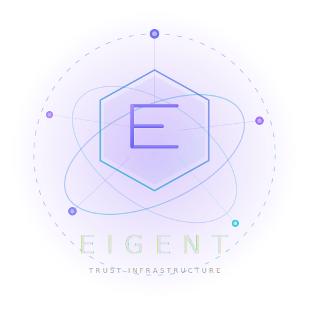

<p align="center">
  
  <br />
  <strong>E I G E N T</strong>
  <br />
  <em>OAuth for AI Agents</em>
</p>

<p align="center">
  <a href="https://github.com/saichandrasekhar/Eigent/actions"></a>
  <a href="LICENSE"></a>
  <a href="https://github.com/saichandrasekhar/Eigent/stargazers"></a>
  <a href="https://pypi.org/project/eigent-scan/"></a>
  <a href="https://www.npmjs.com/package/eigent-sidecar"></a>
  <a href="https://pypi.org/project/eigent-scan/"></a>
</p>

<p align="center">
  <a href="#quick-start">Quick Start</a> &bull;
  <a href="#how-it-works">How It Works</a> &bull;
  <a href="#features">Features</a> &bull;
  <a href="#architecture">Architecture</a> &bull;
  <a href="#comparison">Comparison</a> &bull;
  <a href="https://eigent.dev">Website</a>
</p>

---

## What is Eigent?

**Eigent** is the identity and governance layer for AI agents -- **OAuth for AI Agents**. It provides cryptographic proof that every agent action traces back to the human who authorized it, with delegation chains that narrow permissions at every hop and cascade revocation that instantly kills an entire trust subtree.

**The problem:** AI agents operate with broad, unmonitored access. They call tools, spawn sub-agents, and access sensitive resources with no identity, no audit trail, and no way to trace actions back to the responsible human.

**The solution:** Eigent binds every agent to a human through Ed25519-signed JWS tokens. Agents delegate to sub-agents with mandatory permission narrowing. A sidecar proxy enforces permissions on every MCP tool call. Revoking a parent agent instantly revokes the entire delegation subtree.

---

## How It Works

```
  Human authenticates       Issues token         Delegates with        Sidecar enforces
  via OIDC (Okta/          to Agent A           narrowed scope        every tool call
  Entra/Google)            [read,write,test]    to Agent B [test]     against token scope

  +---------+    eigent    +---------+  eigent  +---------+           +---------+
  |  Alice  | -- login --> | Agent A | delegate | Agent B | -- MCP -> | Sidecar | -> MCP Server
  +---------+    issue     +---------+          +---------+           +---------+
                                                                          |
  eigent revoke Agent A                                              Verify against
  -> cascades to Agent B                                              Registry + Policy
  -> all tokens invalidated                                           Engine (YAML)
```

---

## Quick Start

### Option 1: Docker Compose (recommended)

One command to run the full stack -- registry, sidecar, dashboard, and a demo MCP server:

```bash
git clone https://github.com/saichandrasekhar/Eigent.git
cd Eigent
docker compose up
```

Then in another terminal:

```bash
npm install -g @eigent/cli
eigent init
eigent login -e alice@company.com
eigent issue code-agent --scope read_file,write_file,run_tests
eigent delegate code-agent test-runner --scope run_tests
eigent verify test-runner run_tests     # ALLOWED
eigent verify test-runner delete_file   # DENIED
```

### Option 2: npm

```bash
npm install -g @eigent/cli
cd eigent-registry && npm install && npm run dev   # start registry
eigent init && eigent login -e alice@company.com
eigent issue code-agent --scope read_file,write_file,run_tests
```

### Option 3: Free scanner (no setup)

Discover every AI agent and MCP server in your environment in 30 seconds:

```bash
pip install eigent-scan
eigent-scan scan --verbose
```

---

## Features

<table>
<tr>
<td width="50%">

### Cryptographic Identity (eigent-core)
Ed25519 JWS tokens bind every agent to the human who authorized it. Self-verifiable, tamper-proof. Delegation with scope intersection ensures permissions can only narrow, never widen. 76 tests.

</td>
<td width="50%">

### Identity Registry (eigent-registry)
Hono-based API server with OIDC authentication (Okta, Entra ID, Google), SCIM deprovisioning, cascade revocation, multi-tenancy, API versioning, OpenAPI spec, rate limiting, health checks, and PostgreSQL adapter with AES-256-GCM encryption at rest.

</td>
</tr>
<tr>
<td>

### MCP Enforcement Sidecar (eigent-sidecar)
Intercepts stdio and HTTP MCP traffic. YAML policy engine with glob patterns, delegation depth limits, time windows, and argument regex. Approval queue polling for sensitive operations. OTel spans and Prometheus metrics. Hot-reloadable policies.

</td>
<td>

### CLI (eigent-cli)
16 commands: `init`, `login`, `issue`, `delegate`, `revoke`, `verify`, `chain`, `wrap`, `audit`, `rotate`, `deprovision`, `stale`, `usage`, `compliance-report`, `list`, `logout`. Full lifecycle management from a single binary.

</td>
</tr>
<tr>
<td>

### Python SDK (eigent-py)
`EigentClient` for agent registration, delegation, verification, revocation, audit, and compliance reporting. `@eigent_protected` decorator for tool-level enforcement. LangChain and CrewAI integration examples.

</td>
<td>

### Dashboard (eigent-dashboard)
Next.js with 6 pages: overview dashboard, agent inventory, delegation tree visualization, audit log, policy editor, and compliance reports. NextAuth SSO with RBAC (admin, operator, viewer roles).

</td>
</tr>
<tr>
<td>

### Agent Scanner (eigent-scan)
Scans 14 config locations across Claude Desktop, Cursor, VS Code, and Windsurf. Live process discovery for shadow agents. HTML reports, SARIF for GitHub Security tab, CI/CD integration, and webhook alerts.

</td>
<td>

### Deployment (Helm + Terraform)
Kubernetes Helm chart and Terraform modules for production deployment. Docker Compose for local development with one command.

</td>
</tr>
</table>

---

## Architecture

```
                            +-----------------+
                            |   Dashboard     |
                            |  (Next.js SSO)  |
                            +--------+--------+
                                     |
                                     v
+----------+    REST API    +------------------+    OIDC     +-----------+
| Eigent   | <-----------> |  Eigent Registry  | <--------> | Okta /    |
| CLI      |               |  (Hono API)       |            | Entra /   |
| (16 cmds)|               |                   |            | Google    |
+----------+               | - Agent lifecycle |            +-----------+
     |                      | - Delegation mgmt|
     | spawns               | - Cascade revoke |    +-----------+
     v                      | - SCIM deprov.   | -> | PostgreSQL|
+----------+    verify     | - Compliance rpts |    +-----------+
| Eigent   | <-----------> | - Approval queue  |
| Sidecar  |               | - SIEM webhooks   |
| (MCP     |               | - Multi-tenancy   |
|  proxy)  |               +------------------+
|          |
| - stdio  |               +------------------+
| - HTTP   |               |   Python SDK     |
| - YAML   | <--- MCP ---> |  (eigent-py)     |
|   policy |               |  EigentClient +  |
| - OTel   |               |  @eigent_protect |
| - Prom.  |               +------------------+
+----------+
     |
     v
+----------+               +------------------+
| MCP      |               |   eigent-scan    |
| Server   |               |  (free scanner)  |
+----------+               |  14 config locs  |
                            |  shadow agents   |
                            |  SARIF + HTML    |
                            +------------------+
```

---

## How Eigent Compares

| Capability | **Eigent** | Okta / Entra ID | Aembit | Astrix |
|---|:---:|:---:|:---:|:---:|
| Human-to-agent identity binding | Yes | No | No | Partial |
| Agent-to-agent delegation chains | Yes | No | No | No |
| Permission narrowing at each hop | Yes | No | No | No |
| Cascade revocation | Yes | Partial | No | No |
| MCP-native enforcement sidecar | Yes | No | Partial | No |
| YAML policy engine (glob, time, regex) | Yes | No | No | No |
| Approval queue for sensitive ops | Yes | No | No | No |
| OIDC SSO (Okta, Entra, Google) | Yes | Yes | Yes | No |
| SCIM deprovisioning | Yes | Yes | No | No |
| Multi-tenancy | Yes | Yes | Yes | No |
| Compliance reports (EU AI Act, SOC 2) | Yes | No | No | Partial |
| SIEM webhooks | Yes | Yes | Yes | Yes |
| Python SDK | Yes | Yes | No | No |
| MCP server discovery + scanning | Yes | No | No | Partial |
| Open source | Yes | No | No | No |
| Setup time | **5 minutes** | Weeks | Weeks | Weeks |
| Price | **Free** | $$$$$ | $$$$$ | $$$$$ |

---

## Project Structure

```
eigent-core/               # Ed25519 crypto, JWS tokens, delegation, scope intersection
eigent-registry/           # Hono API server — OIDC, SCIM, multi-tenancy, PostgreSQL
eigent-sidecar/            # MCP interceptor — stdio + HTTP, YAML policy, OTel, Prometheus
eigent-cli/                # 16 CLI commands for full lifecycle management
eigent-py/                 # Python SDK — EigentClient + @eigent_protected decorator
eigent-scan/               # Python scanner — config scan, shadow agents, SARIF, HTML
eigent-dashboard/          # Next.js — 6 pages, SSO, RBAC
deploy/helm/               # Kubernetes Helm chart
deploy/terraform/          # Terraform IaC modules
docker-compose.yml         # One-command local stack
```

---

## CI/CD Integration

### GitHub Action

Scan for unprotected AI agents and push findings to the Security tab:

```yaml
name: AI Agent Security Scan
on: [push, pull_request]

permissions:
  security-events: write
  contents: read

jobs:
  eigent:
    runs-on: ubuntu-latest
    steps:
      - uses: actions/checkout@v4

      - name: Scan for AI agents
        uses: saichandrasekhar/Eigent/eigent-scan@main
        with:
          target: all
          fail-on: high
          upload-sarif: true
```

---

## Contributing

```bash
git clone https://github.com/saichandrasekhar/Eigent.git
cd Eigent

# Core library
cd eigent-core && npm install && npm test    # 76 tests

# Registry
cd eigent-registry && npm install && npm run dev

# CLI
cd eigent-cli && npm install && npm link

# Python SDK
cd eigent-py && pip install -e ".[dev]" && pytest

# Scanner
cd eigent-scan && pip install -e ".[dev]" && pytest
```

See [CONTRIBUTING.md](eigent-scan/CONTRIBUTING.md) for full guidelines.

---

## Community

- **Discussions** -- [GitHub Discussions](https://github.com/saichandrasekhar/Eigent/discussions) for questions and ideas
- **Issues** -- [GitHub Issues](https://github.com/saichandrasekhar/Eigent/issues) for bugs and feature requests
- **Discord** -- [Join our Discord](https://discord.gg/eigent)
- **Twitter** -- [@eigent_dev](https://twitter.com/eigent_dev)

---

## License

[Apache 2.0](LICENSE) -- free forever, no vendor lock-in.

---

<p align="center">
  <strong>Every agent needs a human. Every action needs a chain of custody.</strong>
  <br />
  <a href="https://eigent.dev">eigent.dev</a> &bull; <a href="https://pypi.org/project/eigent-scan/">PyPI</a> &bull; <a href="https://github.com/saichandrasekhar/Eigent/issues">Report a Bug</a>
  <br /><br />
  If Eigent helps you, consider giving it a <a href="https://github.com/saichandrasekhar/Eigent">star</a>. It helps others find it.
</p>
