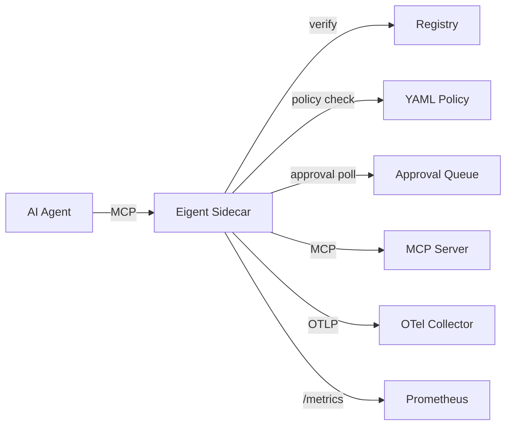

# Sidecar

The Eigent sidecar (`eigent-sidecar`) is an MCP traffic interceptor that enforces Eigent policies on tool calls in real time. It supports both **stdio** and **HTTP proxy** modes, with a **YAML policy engine**, **approval queue polling**, **OpenTelemetry spans**, and **Prometheus metrics**.

**Installation:**

```bash
npm install -g @eigent/sidecar
```

## How It Works

The sidecar implements the MCP protocol on both sides:

- **Upstream:** Presents itself as an MCP server to the AI agent
- **Downstream:** Acts as an MCP client to the actual MCP server
- **Interception:** Intercepts `tools/call` messages and verifies them against the agent's token and the YAML policy engine



All other MCP messages (tool listing, resource access, prompt handling) are passed through transparently.

## Transport Modes

### stdio Mode (default)

The sidecar spawns the MCP server as a child process and pipes stdin/stdout through interceptors. This is the standard mode for Claude Desktop and other stdio-based MCP clients.

```bash
eigent-sidecar --mode enforce --eigent-token "$TOKEN" \
  -- npx -y @modelcontextprotocol/server-filesystem /tmp
```

### HTTP Proxy Mode

The sidecar runs as an HTTP server that proxies requests to a remote MCP server over HTTP/SSE. Use this for network-accessible MCP servers.

```bash
eigent-sidecar --transport http \
  --listen-port 8080 \
  --upstream-url http://mcp-server:3000 \
  --eigent-token "$TOKEN"
```

The sidecar listens on `http://localhost:8080` and proxies verified requests to the upstream MCP server at `http://mcp-server:3000`.

## CLI Usage

```bash
eigent-sidecar [options] -- <server-command> [server-args...]
```

Everything before `--` configures the sidecar. Everything after `--` is the MCP server command (stdio mode only).

### Options

| Option | Default | Description |
|--------|---------|-------------|
| `--mode <mode>` | `enforce` | Operating mode: `enforce` or `monitor` |
| `--transport <type>` | `stdio` | Transport: `stdio` or `http` |
| `--eigent-token <token>` | -- | Inline Eigent token (JWS string) |
| `--eigent-token-file <path>` | -- | Path to token file |
| `--registry-url <url>` | `http://localhost:3456` | Registry endpoint for verification |
| `--policy-file <path>` | -- | Path to YAML policy file |
| `--listen-port <port>` | `8080` | HTTP proxy listen port (http mode) |
| `--upstream-url <url>` | -- | Upstream MCP server URL (http mode) |
| `--approval-poll-interval <ms>` | `5000` | Approval queue polling interval |
| `--otel-endpoint <url>` | -- | OpenTelemetry collector endpoint |
| `--otel-service-name <name>` | `eigent-sidecar` | Service name for OTel spans |
| `--prometheus-port <port>` | -- | Port to expose Prometheus metrics |
| `--log-level <level>` | `info` | Logging: `debug`, `info`, `warn`, `error` |

### Examples

```bash
# Enforce mode with inline token
eigent-sidecar \
  --mode enforce \
  --eigent-token "eyJ..." \
  -- npx -y @modelcontextprotocol/server-filesystem /tmp

# With YAML policy engine
eigent-sidecar \
  --mode enforce \
  --eigent-token-file ~/.eigent/tokens/code-agent.jwt \
  --policy-file ./eigent-policy.yaml \
  -- npx -y @modelcontextprotocol/server-filesystem /tmp

# HTTP proxy mode
eigent-sidecar \
  --transport http \
  --listen-port 8080 \
  --upstream-url http://mcp-server:3000 \
  --eigent-token-file ~/.eigent/tokens/code-agent.jwt \
  --policy-file ./eigent-policy.yaml

# With approval queue + OTel + Prometheus
eigent-sidecar \
  --mode enforce \
  --eigent-token-file ~/.eigent/tokens/code-agent.jwt \
  --policy-file ./eigent-policy.yaml \
  --approval-poll-interval 3000 \
  --otel-endpoint http://localhost:4318 \
  --prometheus-port 9090 \
  -- npx -y @modelcontextprotocol/server-filesystem /tmp
```

## YAML Policy Engine

The policy engine provides fine-grained control beyond token scopes. Policies are defined in YAML and support hot-reloading -- changes take effect without restarting the sidecar.

### Policy File Format

```yaml
# eigent-policy.yaml
version: "1"

policies:
  # Allow read_file only for specific paths
  - tool: "read_file"
    allow: true
    conditions:
      args:
        path: "^/home/user/projects/.*"  # regex on argument values

  # Block write_file during off-hours
  - tool: "write_file"
    allow: true
    conditions:
      time_window:
        start: "09:00"
        end: "18:00"
        timezone: "America/New_York"

  # Allow all tools matching a glob pattern
  - tool: "db:*"
    allow: true
    conditions:
      max_delegation_depth: 2

  # Block dangerous tools entirely
  - tool: "shell_exec"
    allow: false

  # Require approval for production operations
  - tool: "deploy_*"
    allow: true
    require_approval: true

defaults:
  allow: false  # deny by default
```

### Policy Features

| Feature | Syntax | Description |
|---------|--------|-------------|
| **Glob patterns** | `tool: "db:*"` | Match tool names with wildcards |
| **Argument regex** | `args.path: "^/safe/.*"` | Validate tool arguments against regex patterns |
| **Time windows** | `time_window: {start, end, tz}` | Allow/deny based on time of day |
| **Depth limits** | `max_delegation_depth: 2` | Restrict based on delegation chain depth |
| **Approval required** | `require_approval: true` | Route to approval queue before executing |
| **Hot reload** | automatic | Policy file changes are picked up without restart |

### Policy Evaluation Order

1. Token scope check (is the tool in the agent's scope?)
2. YAML policy match (first matching rule wins)
3. Default policy (allow or deny)
4. If `require_approval`, route to approval queue

## Approval Queue Polling

When a policy rule includes `require_approval: true`, the sidecar holds the tool call and polls the registry's approval queue. A human operator approves or denies the request via the CLI or dashboard.

```bash
# Sidecar polls every 3 seconds
eigent-sidecar --approval-poll-interval 3000 \
  --policy-file ./eigent-policy.yaml \
  --eigent-token "$TOKEN" \
  -- npx server-filesystem /tmp
```

On the operator side:

```bash
# List pending approvals
eigent audit --action approval_pending

# Approve via CLI (or use the dashboard)
# The registry API handles approval: POST /api/v1/approvals/:id/approve
```

## Operating Modes

### Enforce Mode

In enforce mode, the sidecar blocks tool calls that fail token verification or policy checks.

```
tools/call -> sidecar -> token check -> policy check
  +-- allowed -> forward to MCP server -> return result
  +-- denied  -> return error to agent, log to audit
  +-- approval required -> hold, poll queue -> forward or deny
```

**Blocked call error response:**

```json
{
  "jsonrpc": "2.0",
  "id": 1,
  "error": {
    "code": -32600,
    "message": "Eigent: permission denied for tool 'shell_exec'. Agent scope: [read_file, write_file]. Contact alice@company.com to request access."
  }
}
```

### Monitor Mode

In monitor mode, all calls are forwarded regardless of permission. The sidecar logs each call with whether it would have been allowed or denied under enforce mode. Useful for evaluating policies before enforcement.

## Environment Variables

| Variable | Description |
|----------|-------------|
| `EIGENT_TOKEN` | Token string (alternative to `--eigent-token`) |
| `EIGENT_REGISTRY_URL` | Registry URL (alternative to `--registry-url`) |
| `EIGENT_POLICY_FILE` | Policy file path (alternative to `--policy-file`) |
| `OTEL_EXPORTER_OTLP_ENDPOINT` | OTel collector URL |
| `OTEL_SERVICE_NAME` | Service name for OTel |

Environment variables are overridden by command-line arguments.

## Claude Desktop Configuration

The sidecar integrates directly with Claude Desktop's MCP server configuration:

```json
{
  "mcpServers": {
    "filesystem": {
      "command": "eigent-sidecar",
      "args": [
        "--mode", "enforce",
        "--eigent-token-file", "~/.eigent/tokens/fs-agent.jwt",
        "--registry-url", "http://localhost:3456",
        "--policy-file", "~/.eigent/policies/filesystem.yaml",
        "--",
        "npx", "-y", "@modelcontextprotocol/server-filesystem",
        "/home/user/projects"
      ]
    }
  }
}
```

See [MCP Integration Guide](../guides/mcp-integration.md) for a complete walkthrough.

## OpenTelemetry Spans

When `--otel-endpoint` is configured, the sidecar exports a span for every tool call:

### Span Attributes

| Attribute | Type | Example |
|-----------|------|---------|
| `mcp.tool.name` | string | `read_file` |
| `mcp.tool.arguments` | string | `{"path": "/tmp/file.txt"}` |
| `eigent.agent.id` | string | `019746a2-...` |
| `eigent.agent.name` | string | `code-agent` |
| `eigent.human.email` | string | `alice@company.com` |
| `eigent.action` | string | `allowed`, `blocked`, or `approval_pending` |
| `eigent.delegation.depth` | int | `1` |
| `eigent.delegation.chain` | string | `019746a2-...,019746b1-...` |
| `eigent.scope` | string | `read_file,write_file` |
| `eigent.mode` | string | `enforce` or `monitor` |
| `eigent.policy.matched_rule` | string | `read_file (allow, args regex)` |

### Span Events

- `eigent.verify.start` -- Verification request sent to registry
- `eigent.verify.complete` -- Verification response received
- `eigent.policy.evaluate` -- Policy engine evaluation result
- `eigent.tool.forward` -- Tool call forwarded to MCP server
- `eigent.tool.blocked` -- Tool call blocked (enforce mode)
- `eigent.approval.pending` -- Tool call waiting for approval

## Prometheus Metrics

When `--prometheus-port` is configured, the sidecar exposes metrics at `http://localhost:<port>/metrics`:

| Metric | Type | Description |
|--------|------|-------------|
| `eigent_tool_calls_total` | counter | Total tool calls (labels: tool, action, agent) |
| `eigent_tool_call_duration_seconds` | histogram | Tool call latency |
| `eigent_policy_evaluations_total` | counter | Policy evaluations (labels: tool, result) |
| `eigent_approval_queue_pending` | gauge | Pending approval requests |
| `eigent_token_verifications_total` | counter | Token verifications (labels: result) |

## Performance

The sidecar adds minimal latency to tool calls:

| Operation | Typical Latency |
|-----------|----------------|
| Token decode (local) | < 1ms |
| Policy evaluation (local) | < 1ms |
| Registry verification (HTTP) | 5-15ms |
| OTel span export (async) | 0ms (non-blocking) |
| Prometheus metrics (async) | 0ms (non-blocking) |
| Total overhead per tool call | ~10-20ms |

## Troubleshooting

### Sidecar exits immediately

Check that the MCP server command after `--` is valid:

```bash
# Test the MCP server directly
npx -y @modelcontextprotocol/server-filesystem /tmp
```

### All calls blocked

1. Verify the token's scope matches the tool names
2. Check the YAML policy file for overly restrictive rules
3. Ensure `defaults.allow` is not `false` without matching allow rules

```bash
# Decode the token to see scopes
cat ~/.eigent/tokens/code-agent.jwt | cut -d. -f2 | base64 -d | jq .scope
```

### Policy changes not taking effect

The policy engine hot-reloads on file change. Verify the file path is correct and the YAML is valid:

```bash
eigent-sidecar --log-level debug --policy-file ./policy.yaml ...
```

### Registry connection refused

```bash
curl http://localhost:3456/api/v1/health
```
