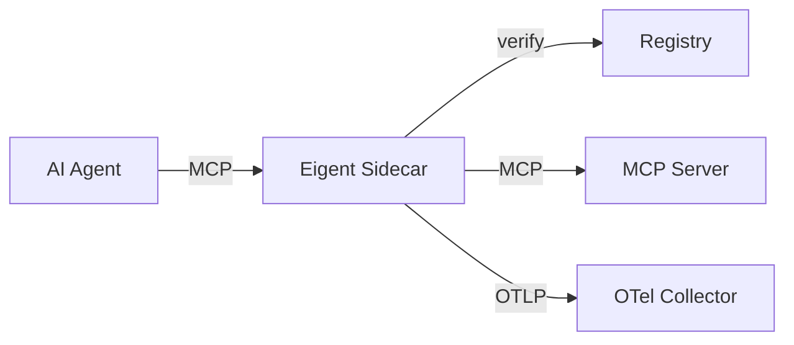

# Sidecar

The Eigent sidecar (`eigent-sidecar`) is a lightweight MCP traffic interceptor that enforces Eigent policies on tool calls in real time. It sits between the AI agent (MCP client) and the MCP server, verifying every request against the agent's token before forwarding.

**Installation:**

```bash
npm install -g @eigent/sidecar
```

## How It Works

The sidecar implements the MCP protocol on both sides:

- **Upstream:** Presents itself as an MCP server to the AI agent
- **Downstream:** Acts as an MCP client to the actual MCP server
- **Interception:** Intercepts `tools/call` messages and verifies them against the registry



All other MCP messages (tool listing, resource access, prompt handling) are passed through transparently.

## CLI Usage

```bash
eigent-sidecar [options] -- <server-command> [server-args...]
```

Everything before `--` configures the sidecar. Everything after `--` is the MCP server command.

### Options

| Option | Default | Description |
|--------|---------|-------------|
| `--mode <mode>` | `enforce` | Operating mode: `enforce` or `monitor` |
| `--eigent-token <token>` | — | Inline Eigent token (JWS string) |
| `--eigent-token-file <path>` | — | Path to token file |
| `--registry-url <url>` | `http://localhost:3456` | Registry endpoint for verification |
| `--otel-endpoint <url>` | — | OpenTelemetry collector endpoint |
| `--otel-service-name <name>` | `eigent-sidecar` | Service name for OTel spans |
| `--log-level <level>` | `info` | Logging: `debug`, `info`, `warn`, `error` |

### Examples

```bash
# Enforce mode with inline token
eigent-sidecar \
  --mode enforce \
  --eigent-token "eyJ..." \
  -- npx -y @modelcontextprotocol/server-filesystem /tmp

# Enforce mode with token file
eigent-sidecar \
  --mode enforce \
  --eigent-token-file ~/.eigent/tokens/code-agent.jwt \
  -- npx -y @modelcontextprotocol/server-filesystem /tmp

# Monitor mode (log but don't block)
eigent-sidecar \
  --mode monitor \
  --eigent-token-file ~/.eigent/tokens/code-agent.jwt \
  -- npx -y @modelcontextprotocol/server-filesystem /tmp

# With OpenTelemetry export
eigent-sidecar \
  --mode enforce \
  --eigent-token-file ~/.eigent/tokens/code-agent.jwt \
  --otel-endpoint http://localhost:4318 \
  --otel-service-name my-agent-sidecar \
  -- npx -y @modelcontextprotocol/server-filesystem /tmp
```

## Operating Modes

### Enforce Mode

In enforce mode, the sidecar verifies every `tools/call` request against the registry. If the agent's token does not authorize the tool, the call is blocked with an error response.

```
tools/call → sidecar → registry.verify()
  ├── allowed → forward to MCP server → return result
  └── denied  → return error to agent, log to audit
```

**Blocked call error response:**

```json
{
  "jsonrpc": "2.0",
  "id": 1,
  "error": {
    "code": -32600,
    "message": "Eigent: permission denied for tool 'shell_exec'. Agent scope: [read_file, write_file]. Contact alice@company.com to request access."
  }
}
```

The error message includes the authorizing human's email so the agent can inform the user who to contact for additional permissions.

### Monitor Mode

In monitor mode, all calls are forwarded regardless of permission. The sidecar logs each call with whether it would have been allowed or denied under enforce mode.

This is useful for:

- Evaluating Eigent before enabling enforcement
- Understanding what tools agents actually call
- Building scope configurations based on observed behavior

Monitor mode audit actions:

| Action | Meaning |
|--------|---------|
| `tool_call_allowed` | Would be allowed in enforce mode |
| `tool_call_would_block` | Would be blocked in enforce mode |

## Environment Variables

The sidecar also accepts configuration via environment variables:

| Variable | Description |
|----------|-------------|
| `EIGENT_TOKEN` | Token string (alternative to `--eigent-token`) |
| `EIGENT_REGISTRY_URL` | Registry URL (alternative to `--registry-url`) |
| `OTEL_EXPORTER_OTLP_ENDPOINT` | OTel collector URL |
| `OTEL_SERVICE_NAME` | Service name for OTel |

Environment variables are overridden by command-line arguments.

## Claude Desktop Configuration

The sidecar integrates directly with Claude Desktop's MCP server configuration:

```json
{
  "mcpServers": {
    "filesystem": {
      "command": "eigent-sidecar",
      "args": [
        "--mode", "enforce",
        "--eigent-token-file", "~/.eigent/tokens/fs-agent.jwt",
        "--registry-url", "http://localhost:3456",
        "--",
        "npx", "-y", "@modelcontextprotocol/server-filesystem",
        "/home/user/projects"
      ]
    }
  }
}
```

See [Claude Desktop Setup](../guides/claude-desktop.md) for a complete walkthrough.

## OpenTelemetry Spans

When `--otel-endpoint` is configured, the sidecar exports a span for every tool call:

### Span Attributes

| Attribute | Type | Example |
|-----------|------|---------|
| `mcp.tool.name` | string | `read_file` |
| `mcp.tool.arguments` | string | `{"path": "/tmp/file.txt"}` |
| `eigent.agent.id` | string | `019746a2-...` |
| `eigent.agent.name` | string | `code-agent` |
| `eigent.human.email` | string | `alice@company.com` |
| `eigent.action` | string | `allowed` or `blocked` |
| `eigent.delegation.depth` | int | `1` |
| `eigent.delegation.chain` | string | `019746a2-...,019746b1-...` |
| `eigent.scope` | string | `read_file,write_file` |
| `eigent.mode` | string | `enforce` or `monitor` |

### Span Events

- `eigent.verify.start` — Verification request sent to registry
- `eigent.verify.complete` — Verification response received
- `eigent.tool.forward` — Tool call forwarded to MCP server
- `eigent.tool.blocked` — Tool call blocked (enforce mode)

## Using with eigent wrap

The `eigent wrap` CLI command is a convenience wrapper around the sidecar:

```bash
# These are equivalent:
eigent wrap npx server-filesystem /tmp --agent code-agent

eigent-sidecar \
  --mode enforce \
  --eigent-token "$(cat ~/.eigent/tokens/code-agent.jwt)" \
  --registry-url "$(cat .eigent/config.json | jq -r .registryUrl)" \
  -- npx server-filesystem /tmp
```

`eigent wrap` reads the token and registry URL from the local Eigent configuration automatically.

## Performance

The sidecar adds minimal latency to tool calls:

| Operation | Typical Latency |
|-----------|----------------|
| Token decode (local) | < 1ms |
| Registry verification (HTTP) | 5-15ms |
| OTel span export (async) | 0ms (non-blocking) |
| Total overhead per tool call | ~10-20ms |

For high-throughput scenarios, consider caching verification results for short periods (e.g., 30 seconds). The sidecar's overhead is negligible compared to typical LLM response times.

## Troubleshooting

### Sidecar exits immediately

Check that the MCP server command after `--` is valid:

```bash
# Test the MCP server directly
npx -y @modelcontextprotocol/server-filesystem /tmp
```

### All calls blocked

Verify the token's scope matches the tool names:

```bash
# Decode the token to see scopes
cat ~/.eigent/tokens/code-agent.jwt | cut -d. -f2 | base64 -d | jq .scope
```

### Registry connection refused

Ensure the registry is running and accessible:

```bash
curl http://localhost:3456/api/health
```

### OTel spans not appearing

Verify the collector is running and accessible:

```bash
curl http://localhost:4318/v1/traces
```

Check the sidecar's log output at `--log-level debug` for export errors.
