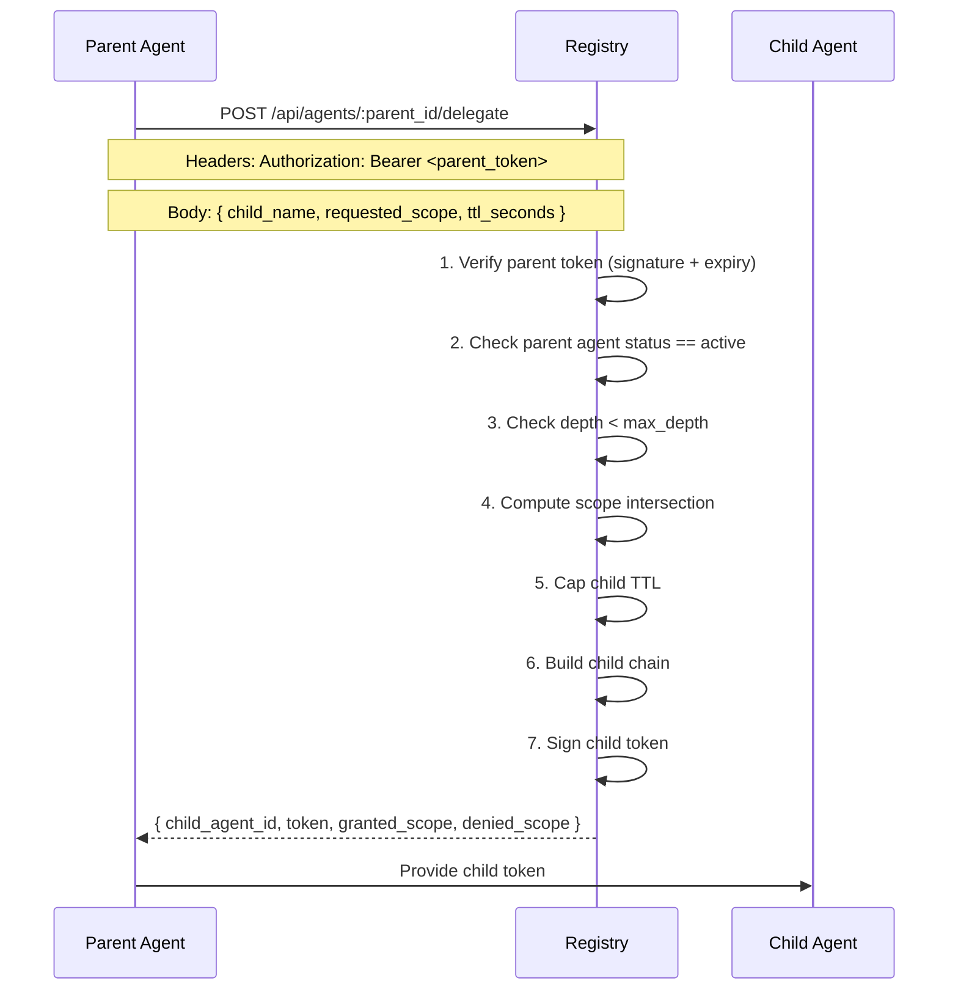

# Protocol Specification

This document specifies the Eigent token format, delegation protocol, and MCP sidecar wire format. It serves as a reference for implementors building Eigent-compatible systems.

## Token Format

### JWS Compact Serialization

Eigent tokens use the JWS Compact Serialization format defined in RFC 7515:

```
BASE64URL(UTF8(JWS Protected Header)) || '.' ||
BASE64URL(JWS Payload) || '.' ||
BASE64URL(JWS Signature)
```

### Protected Header

```json
{
  "alg": "EdDSA",
  "typ": "eigent+jwt",
  "kid": "<jwk-thumbprint>"
}
```

| Field | Required | Value | Specification |
|-------|:--------:|-------|---------------|
| `alg` | Yes | `EdDSA` | RFC 8037 |
| `typ` | Yes | `eigent+jwt` | Custom type identifier |
| `kid` | Yes | JWK Thumbprint (SHA-256) | RFC 7638 |

The `typ` field distinguishes Eigent tokens from other JWT/JWS tokens. Verifiers MUST reject tokens without `typ: eigent+jwt`.

### Payload

```json
{
  "jti": "<uuidv7>",
  "sub": "spiffe://<trust-domain>/agent/<agent-id>",
  "iss": "<registry-url>",
  "aud": "<trust-domain>",
  "iat": <unix-timestamp>,
  "exp": <unix-timestamp>,
  "human": {
    "sub": "<idp-subject>",
    "email": "<email>",
    "iss": "<idp-url>",
    "groups": ["<group>", ...]
  },
  "agent": {
    "name": "<agent-name>",
    "model": "<model-id>",
    "framework": "<framework>"
  },
  "scope": ["<tool-name>", ...],
  "delegation": {
    "depth": <integer>,
    "max_depth": <integer>,
    "chain": ["spiffe://<trust-domain>/agent/<id>", ...],
    "can_delegate": ["<tool-name>", ...]
  }
}
```

#### Standard Claims

| Claim | Type | Required | Constraints |
|-------|------|:--------:|-------------|
| `jti` | string | Yes | UUIDv7 format |
| `sub` | string | Yes | SPIFFE URI: `spiffe://<domain>/agent/<uuid>` |
| `iss` | string | Yes | Valid URL |
| `aud` | string | Yes | Non-empty string |
| `iat` | number | Yes | Unix timestamp (seconds) |
| `exp` | number | Yes | Unix timestamp (seconds), `exp > iat` |

#### Human Binding

| Field | Type | Required | Constraints |
|-------|------|:--------:|-------------|
| `human.sub` | string | Yes | Non-empty |
| `human.email` | string | Yes | Valid email format |
| `human.iss` | string | Yes | Valid URL |
| `human.groups` | string[] | Yes | Array of strings (may be empty) |

#### Agent Metadata

| Field | Type | Required | Constraints |
|-------|------|:--------:|-------------|
| `agent.name` | string | Yes | Non-empty, 1-255 characters |
| `agent.model` | string | No | LLM model identifier |
| `agent.framework` | string | No | Agent framework name |

#### Scope

| Field | Type | Required | Constraints |
|-------|------|:--------:|-------------|
| `scope` | string[] | Yes | At least one element. Each element is non-empty. |

Scope values support three matching patterns:

```
"read_file"    → exact match
"db:*"         → prefix wildcard (matches "db:" followed by anything)
"*"            → global wildcard (matches everything)
```

#### Delegation

| Field | Type | Required | Constraints |
|-------|------|:--------:|-------------|
| `delegation.depth` | number | Yes | Integer >= 0 |
| `delegation.max_depth` | number | Yes | Integer >= 0, `max_depth >= depth` |
| `delegation.chain` | string[] | Yes | Array of SPIFFE URIs, length == depth |
| `delegation.can_delegate` | string[] | Yes | Subset of `scope` |

### Signature

The signature is computed over:

```
ASCII(BASE64URL(UTF8(JWS Protected Header)) || '.' || BASE64URL(JWS Payload))
```

Using the Ed25519 algorithm (RFC 8032) with the registry's private key.

## Delegation Protocol

### Token Exchange

Delegation follows an RFC 8693-style token exchange pattern:



### Scope Intersection Algorithm

```
INPUT:
  parent_scope: string[]     — parent's current scope
  requested: string[]        — what the child is asking for
  can_delegate: string[]     — what the parent is allowed to delegate

OUTPUT:
  granted: string[]          — scopes the child receives
  denied: string[]           — scopes the child requested but didn't get

ALGORITHM:
  granted = []
  denied = []

  for each scope in requested:
    if scope IN parent_scope AND scope IN can_delegate:
      granted.append(scope)
    else:
      denied.append(scope)

  if granted is empty:
    REJECT delegation

  return (granted, denied)
```

### Child Token Construction

The child token is constructed as follows:

| Field | Value |
|-------|-------|
| `sub` | `spiffe://<parent-trust-domain>/agent/<new-uuidv7>` |
| `iss` | Same as parent |
| `aud` | Same as parent |
| `human` | Copied from parent (immutable) |
| `agent` | From delegation request (child's metadata) |
| `scope` | Intersection result (granted scopes) |
| `delegation.depth` | `parent.depth + 1` |
| `delegation.max_depth` | Same as parent |
| `delegation.chain` | `[...parent.chain, parent.sub]` |
| `delegation.can_delegate` | `granted ∩ parent.can_delegate` |
| `exp` | `min(now + requested_ttl, parent.exp)` |

### Invariants

The delegation protocol maintains the following invariants:

1. **Monotonic scope narrowing:** `child.scope ⊆ parent.scope`
2. **Monotonic delegation narrowing:** `child.can_delegate ⊆ child.scope`
3. **Depth monotonicity:** `child.depth == parent.depth + 1`
4. **Chain consistency:** `len(child.chain) == child.depth`
5. **TTL bounding:** `child.exp <= parent.exp`
6. **Human immutability:** `child.human == parent.human`
7. **No circular references:** `child.sub NOT IN child.chain`

## Verification Protocol

### Verification Request

```
POST /api/verify
Content-Type: application/json

{
  "token": "<jws-compact>",
  "tool_name": "<tool-to-verify>"
}
```

### Verification Algorithm

```
INPUT:
  token: string          — JWS compact serialization
  tool_name: string      — tool being called

ALGORITHM:
  1. Decode JWS header
     REJECT if header.typ != "eigent+jwt"
     REJECT if header.alg != "EdDSA"

  2. Verify signature using registry public key
     REJECT if signature invalid

  3. Check temporal validity
     REJECT if now < iat
     REJECT if now > exp

  4. Check required claims
     REJECT if any of: sub, iss, aud, jti, human, agent, scope, delegation missing

  5. Look up agent record by token JTI
     REJECT if agent not found

  6. Check agent status
     REJECT if status == "revoked"
     REJECT if expires_at < now

  7. Check scope
     for each scope_entry in agent.scope:
       if scope_entry == tool_name: ALLOW
       if scope_entry == "*": ALLOW
       if scope_entry ends with ":*":
         if tool_name starts with scope_entry[0..n-1]: ALLOW
     DENY

  8. Log audit event
     Record: agent_id, human_email, action (allowed/blocked), tool_name, chain

OUTPUT:
  { allowed: boolean, agent_id, human_email, delegation_chain, reason }
```

## MCP Sidecar Wire Format

### Interception Point

The sidecar intercepts MCP JSON-RPC messages on the stdio transport. It inspects the `method` field of each message:

| Method | Action |
|--------|--------|
| `tools/call` | Verify against registry, then forward or block |
| `tools/list` | Pass through (no authorization needed) |
| `resources/*` | Pass through |
| `prompts/*` | Pass through |
| `initialize` | Pass through |
| Other | Pass through |

### tools/call Interception

**Incoming message (from agent):**

```json
{
  "jsonrpc": "2.0",
  "id": 1,
  "method": "tools/call",
  "params": {
    "name": "read_file",
    "arguments": {
      "path": "/tmp/data.txt"
    }
  }
}
```

**Sidecar extracts:** `params.name` ("read_file")

**Sidecar verifies:** `POST /api/verify { token, tool_name: "read_file" }`

**If allowed:** Forward original message to MCP server, relay response back.

**If denied:** Return error without forwarding:

```json
{
  "jsonrpc": "2.0",
  "id": 1,
  "error": {
    "code": -32600,
    "message": "Eigent: permission denied for tool 'read_file'. Agent scope: [run_tests]. Contact alice@company.com to request access."
  }
}
```

The error code `-32600` (Invalid Request) is used per the JSON-RPC 2.0 specification.

## OpenTelemetry Semantic Conventions

The sidecar exports spans following a draft semantic convention for MCP tool calls:

### Span Name

```
eigent.verify {tool_name}
```

### Span Kind

`INTERNAL`

### Attributes

| Attribute | Type | Description |
|-----------|------|-------------|
| `mcp.tool.name` | string | Tool being called |
| `mcp.tool.arguments` | string | JSON-encoded arguments |
| `mcp.transport` | string | `stdio` or `sse` |
| `eigent.agent.id` | string | Agent identifier |
| `eigent.agent.name` | string | Agent name |
| `eigent.human.email` | string | Authorizing human's email |
| `eigent.action` | string | `allowed`, `blocked`, or `would_block` |
| `eigent.scope` | string | Comma-separated agent scope |
| `eigent.delegation.depth` | int | Delegation depth |
| `eigent.delegation.chain` | string | Comma-separated chain IDs |
| `eigent.mode` | string | `enforce` or `monitor` |
| `eigent.verify.duration_ms` | float | Registry verification latency |

### Span Events

| Event | Timestamp | Description |
|-------|-----------|-------------|
| `eigent.verify.start` | T0 | Verification request sent |
| `eigent.verify.complete` | T1 | Verification response received |
| `eigent.tool.forward` | T2 | Tool call forwarded (if allowed) |
| `eigent.tool.complete` | T3 | Tool call result received |

See the [OTel MCP Convention](https://github.com/saichandrasekhar/Eigent/tree/main/otel-mcp-convention) draft for the full specification.
