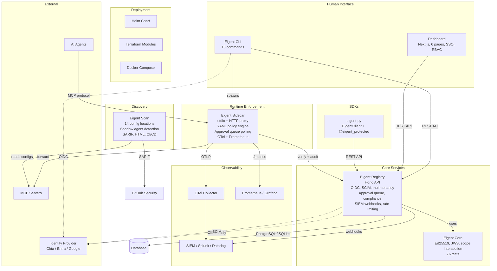
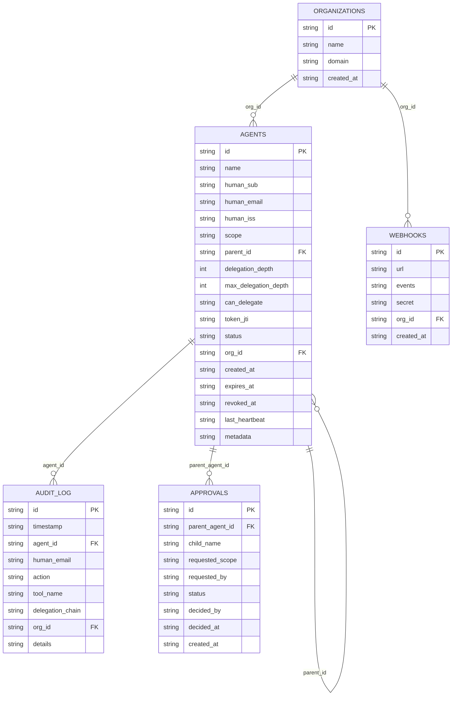
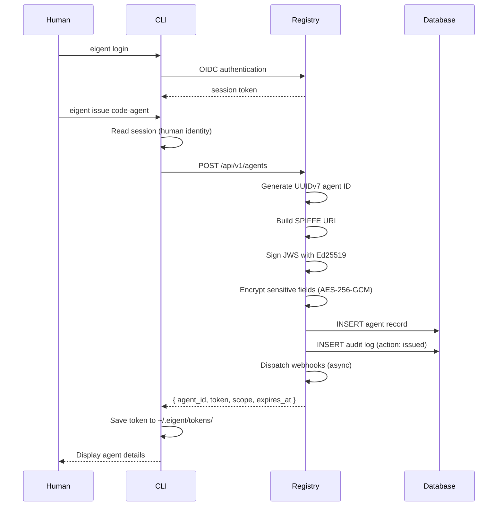
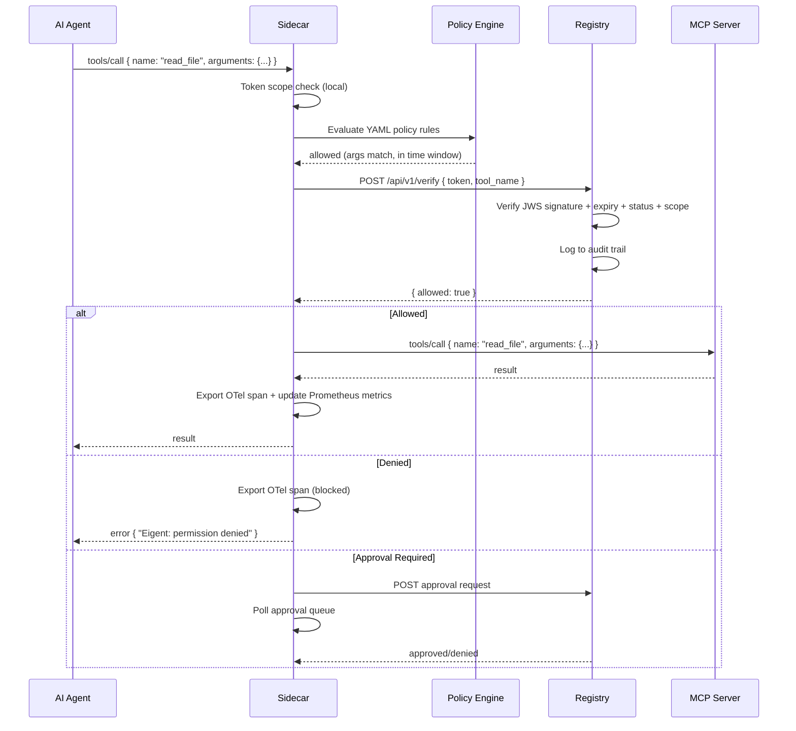
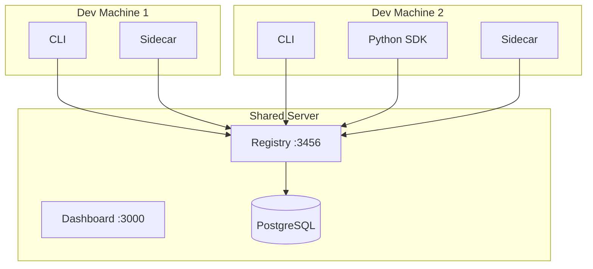
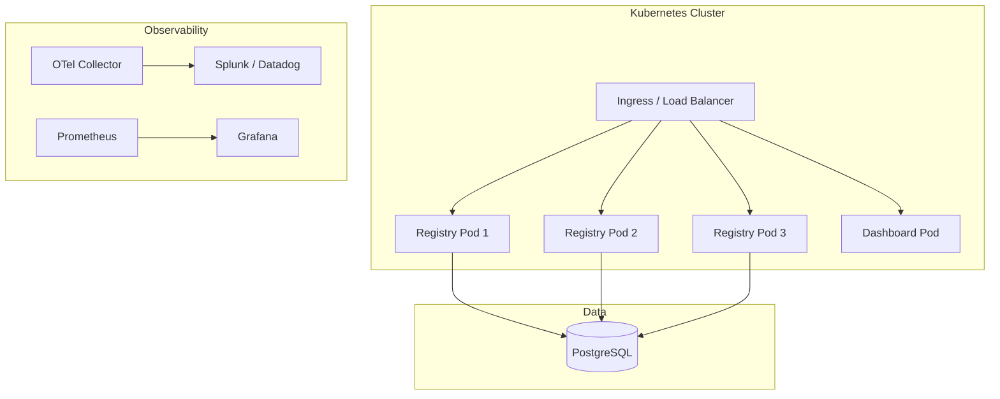

# System Design

Eigent is composed of eight components that together provide agent identity, delegation governance, permission enforcement, discovery, and observability. This page describes each component, their interactions, and deployment models.

## Component Architecture



## Components

### Eigent Core (`@eigent/core`)

The core library provides cryptographic primitives used by the CLI, registry, and sidecar. Zero network dependencies.

**Responsibilities:**

- Ed25519 key generation and management
- JWS token issuance and validation
- Three-way scope intersection computation
- Delegation chain validation (depth limits, permission narrowing)
- Revocation store interface

**Key design decisions:**

- `jose` library for JWS operations (audited, maintained)
- Zod schemas for runtime validation
- SPIFFE URI format for agent identifiers
- UUIDv7 for time-ordered unique IDs
- In-memory revocation store with pluggable interface
- 76 tests covering all crypto and delegation logic

### Eigent Registry (`@eigent/registry`)

The central identity server. Built with Hono.

**Responsibilities:**

- OIDC authentication (Okta, Entra ID, Google)
- Agent record storage and lifecycle (registration, delegation, revocation, rotation, expiry, heartbeat)
- Cascade revocation across the delegation tree
- SCIM deprovisioning -- automatic agent cleanup when users leave
- Multi-tenancy with organization-scoped isolation
- Approval queue for sensitive delegations
- Compliance reports (EU AI Act, SOC 2, ISO 27001)
- SIEM webhooks (Splunk, Datadog, PagerDuty, Slack)
- API versioning with OpenAPI spec
- Rate limiting (configurable per-endpoint)
- Health checks with dependency status
- AES-256-GCM encryption at rest
- JWKS endpoint for offline token verification

**Key design decisions:**

- SQLite for development (zero-dependency); PostgreSQL adapter for production
- AES-256-GCM encryption for sensitive fields at rest
- Audit log in the same database for transactional consistency
- API versioned under `/api/v1/`

**Database schema:**



### Eigent Sidecar (`@eigent/sidecar`)

MCP traffic interceptor with policy enforcement and observability.

**Responsibilities:**

- MCP protocol implementation (server and client sides)
- **stdio transport** for Claude Desktop and local agents
- **HTTP proxy transport** for network-accessible MCP servers
- Token-based authorization for every `tools/call`
- **YAML policy engine** with glob patterns, argument regex, time windows, delegation depth limits, and hot-reload
- **Approval queue polling** for sensitive operations
- OpenTelemetry span export
- Prometheus metrics endpoint
- Enforce and monitor operating modes

**Key design decisions:**

- Dual transport: stdio (default) and HTTP proxy
- Policy engine evaluates locally (no network call for policy rules)
- Hot-reload watches policy file for changes
- Async OTel/Prometheus export (non-blocking)
- Error messages include the authorizing human's email for escalation

### Eigent CLI (`@eigent/cli`)

16 commands for complete agent lifecycle management. Written in TypeScript with Commander.js, Inquirer.js, and Chalk.

**Commands:**

| Command | Description |
|---------|-------------|
| `init` | Initialize Eigent for a project |
| `login` | Authenticate as a human via OIDC |
| `issue` | Issue a signed agent token |
| `delegate` | Delegate permissions to a child agent |
| `revoke` | Revoke an agent and cascade |
| `verify` | Check if an agent can call a tool |
| `chain` | Show the delegation chain |
| `wrap` | Wrap an MCP server with the sidecar |
| `audit` | Query the audit log |
| `rotate` | Rotate agent keys |
| `deprovision` | Deprovision a user (SCIM) |
| `stale` | Find stale agents |
| `usage` | Show agent usage statistics |
| `compliance-report` | Generate compliance evidence |
| `list` | List all agents |
| `logout` | Clear the session |

### eigent-py (Python SDK)

Python SDK providing `EigentClient` for programmatic access and `@eigent_protected` decorator for tool-level enforcement.

**Features:**

- Typed client for registration, delegation, verification, revocation, audit, compliance
- `@eigent_protected` decorator -- verifies token scope before each tool call
- LangChain and CrewAI integration examples
- EU AI Act risk classification support

### Eigent Scan (`eigent-scan`)

Standalone Python scanner for discovering AI agents and MCP servers. Operates independently of the rest of the stack.

**Responsibilities:**

- Configuration file scanning (14 locations across Claude Desktop, Cursor, VS Code, Windsurf)
- Live process discovery (shadow agent detection)
- Security risk assessment (6 checks per server)
- Multi-format reporting (SARIF, HTML, JSON, table)
- CI/CD integration (GitHub Action, GitLab CI, Jenkins)
- Webhook alerts (Slack, PagerDuty, Teams)
- Scan history and drift detection

### Eigent Dashboard (`eigent-dashboard`)

Next.js dashboard with 6 pages for visual management and monitoring.

**Pages:**

1. **Dashboard** -- overview metrics, active agents, recent events
2. **Agents** -- agent inventory with search, filter, and bulk actions
3. **Delegation Tree** -- visual tree of delegation chains
4. **Audit Log** -- searchable, filterable event history
5. **Policies** -- YAML policy editor with validation
6. **Compliance** -- compliance report viewer and evidence export

**Features:**

- NextAuth SSO integration
- RBAC with three roles: admin, operator, viewer
- Real-time updates via registry API polling

## Data Flow

### Token Issuance Flow



### Tool Call Verification Flow



## Deployment Models

### Local Development (Docker Compose)

```bash
docker compose up
```

Starts registry (SQLite), dashboard, sidecar, and demo MCP server on a single machine.

### Team Deployment



### Production (Kubernetes via Helm)

```bash
helm install eigent deploy/helm/eigent \
  --set registry.replicas=3 \
  --set registry.database.url=postgres://... \
  --set registry.masterKey=... \
  --set registry.oidc.issuer=https://your-idp.com
```



### Infrastructure as Code (Terraform)

```bash
cd deploy/terraform
terraform init
terraform apply
```

Modules available for AWS, GCP, and Azure.

## Technology Stack

| Component | Language | Framework | Key Dependencies |
|-----------|----------|-----------|------------------|
| Core | TypeScript | -- | jose, zod, uuid |
| Registry | TypeScript | Hono | PostgreSQL adapter, AES-256-GCM |
| Sidecar | TypeScript | -- | MCP SDK, OTLP, prom-client |
| CLI | TypeScript | Commander.js | chalk, ora, inquirer |
| Python SDK | Python | -- | requests, pydantic |
| Scanner | Python | -- | click, rich |
| Dashboard | TypeScript | Next.js | NextAuth, Tailwind, Recharts |
| Helm | YAML | Helm 3 | -- |
| Terraform | HCL | Terraform | -- |
