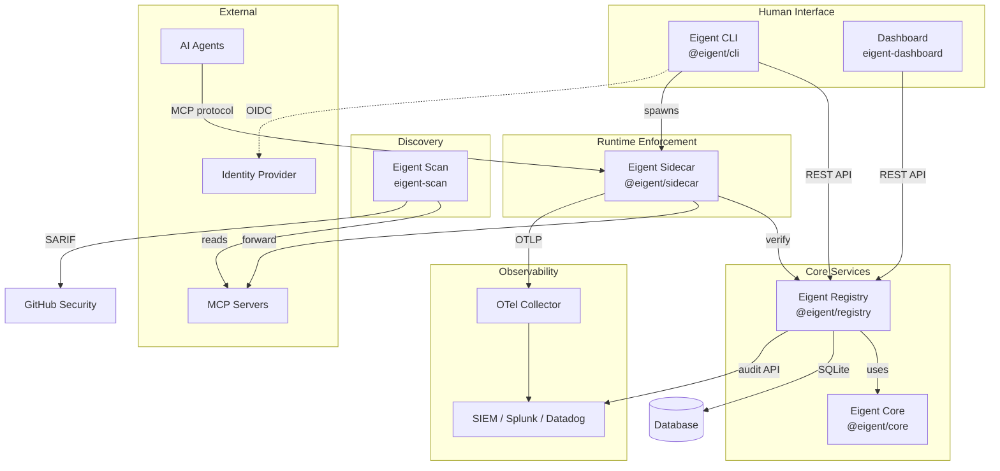
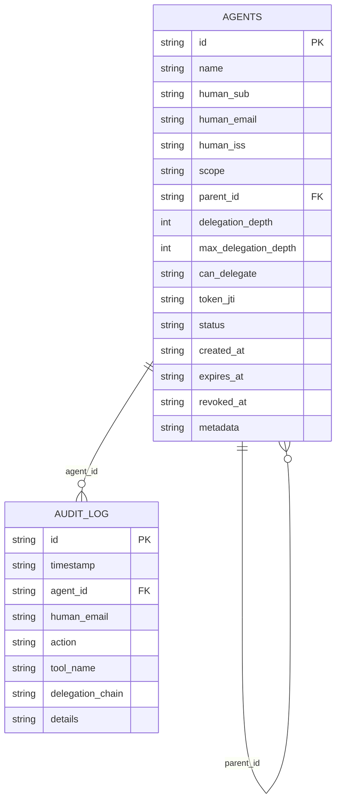
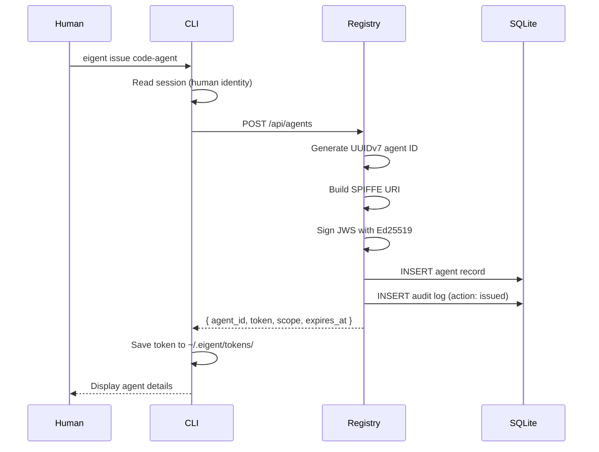
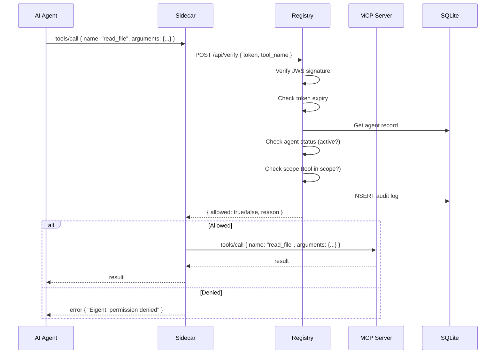
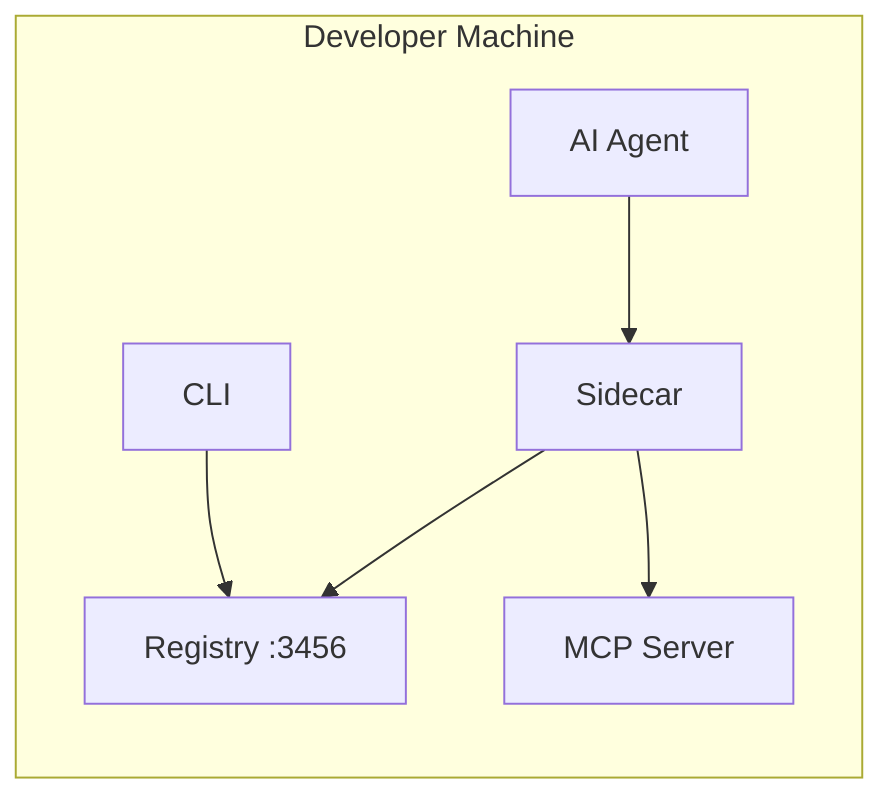
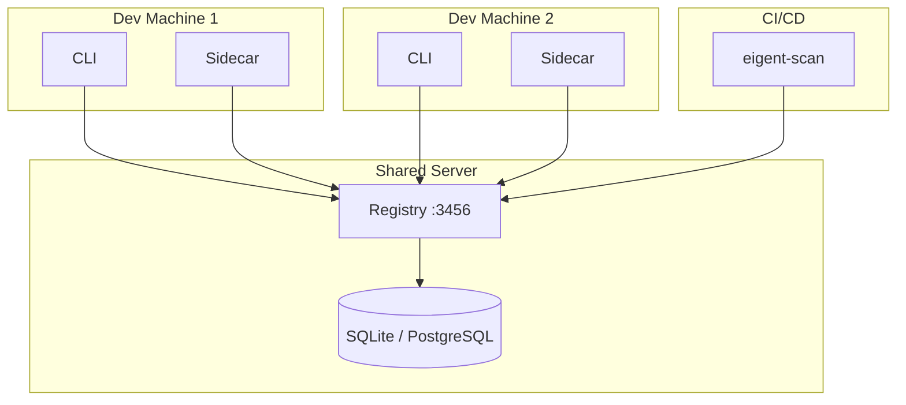
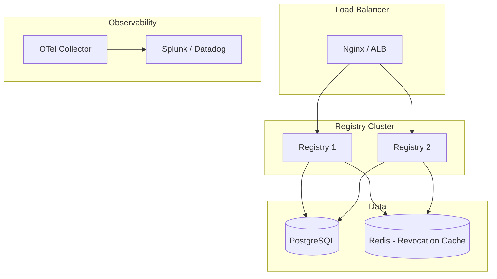

# System Design

Eigent is composed of five components that together provide agent identity, permission enforcement, discovery, and observability. This page describes each component, their interactions, and deployment models.

## Component Architecture

## Components

### Eigent CLI (`@eigent/cli`)

The CLI is the human-facing interface for agent identity management. Written in TypeScript with Commander.js, Inquirer.js, and Chalk.

**Responsibilities:**

- Human authentication (OIDC flow)
- Agent token issuance and delegation
- Token verification and revocation
- Audit log queries
- Sidecar orchestration via `eigent wrap`

**Key design decisions:**

- Stateful sessions stored in `~/.eigent/session.json`
- Tokens stored as files in `~/.eigent/tokens/<name>.jwt`
- Project configuration in `.eigent/config.json`
- All registry communication via REST API

### Eigent Core (`@eigent/core`)

The core library provides cryptographic primitives used by both the CLI and the registry. It has zero network dependencies and can be used in any Node.js environment.

**Responsibilities:**

- Ed25519 key generation and management
- JWS token issuance and validation
- Scope intersection computation
- Delegation chain validation
- Revocation store interface

**Key design decisions:**

- Uses the `jose` library for JWS operations (audited, maintained)
- Zod schemas for runtime validation of all inputs
- SPIFFE URI format for agent identifiers
- UUIDv7 for time-ordered unique identifiers
- In-memory revocation store with a pluggable interface

### Eigent Registry (`@eigent/registry`)

The registry is the central identity server. Built with Hono (a fast, lightweight web framework) and better-sqlite3.

**Responsibilities:**

- Agent record storage and lifecycle management
- Token issuance with registry-managed Ed25519 keys
- Token verification (signature + expiry + scope + status)
- Delegation chain tracking with parent-child relationships
- Cascade revocation across the delegation tree
- Audit log recording and querying
- JWKS endpoint for offline verification

**Key design decisions:**

- Embedded SQLite for zero-dependency deployment
- Synchronous database operations (better-sqlite3) for simplicity and consistency
- No external dependencies for state (no Redis, no Postgres required)
- Audit log in the same database for transactional consistency
- JWKS endpoint enables offline token verification

**Database schema:**

### Eigent Sidecar (`@eigent/sidecar`)

The sidecar is a transparent MCP proxy that intercepts tool calls and enforces permissions in real time.

**Responsibilities:**

- MCP protocol implementation (both server and client sides)
- Token-based authorization for every `tools/call`
- OpenTelemetry span export for observability
- Monitor and enforce operating modes

**Key design decisions:**

- stdio transport for Claude Desktop compatibility
- Transparent passthrough for non-tool-call messages
- Async OTel export (non-blocking)
- Error messages include the authorizing human's email for escalation

### Eigent Scan (`eigent-scan`)

The scanner is a standalone Python tool for discovering AI agents and MCP servers. It operates independently of the rest of the Eigent stack.

**Responsibilities:**

- Configuration file scanning (14 locations across 5 tools)
- Live process discovery (shadow agent detection)
- Security risk assessment (6 checks per server)
- Multi-format reporting (SARIF, HTML, JSON, table)
- CI/CD integration (GitHub Action, GitLab CI)

**Key design decisions:**

- Python for broad compatibility and easy CI/CD integration
- Read-only operation (never modifies discovered configs)
- SARIF output for GitHub Advanced Security integration
- Pluggable scanner architecture for adding new config locations

## Data Flow

### Token Issuance Flow

### Tool Call Verification Flow

## Deployment Models

### Local Development

Everything runs on a single machine. The registry uses an embedded SQLite database. No external services required.

**Best for:** Individual developers, prototyping, CI/CD pipelines.

### Team Deployment

The registry runs on a shared server. Multiple developers and agents connect to the same registry.

**Best for:** Small teams, shared development environments.

### Production Deployment

The registry runs behind a load balancer with a persistent database. OTel collector aggregates telemetry. SIEM receives audit events.

**Best for:** Production environments, regulated industries, multi-team organizations.

## Technology Stack

| Component | Language | Framework | Key Dependencies |
|-----------|----------|-----------|------------------|
| CLI | TypeScript | Commander.js | chalk, ora, inquirer |
| Core | TypeScript | — | jose, zod, uuid |
| Registry | TypeScript | Hono | better-sqlite3, jose |
| Sidecar | TypeScript | — | MCP SDK, OTLP |
| Scanner | Python | — | Click, rich |
| Dashboard | TypeScript | React | Tailwind, Recharts |
