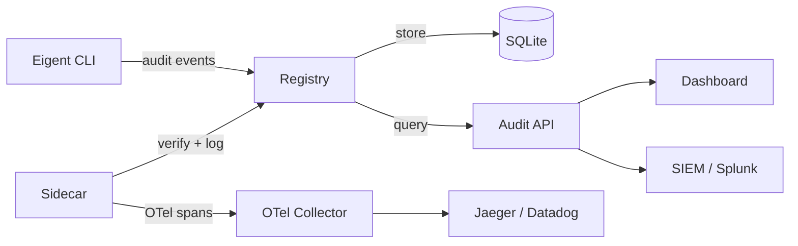

# Audit Trail

Every action in the Eigent system is recorded in a tamper-evident audit log. The audit trail provides complete visibility into agent lifecycle events, tool call authorizations, and delegation changes, all tied back to the authorizing human.

## What Gets Logged

The registry records six categories of audit events:

| Action | Description | Logged When |
|--------|-------------|-------------|
| `issued` | A new agent identity was created | `eigent issue` or `POST /api/agents` |
| `delegated` | Permissions were delegated to a child agent | `eigent delegate` or `POST /api/agents/:id/delegate` |
| `revoked` | An agent was revoked (direct or cascade) | `eigent revoke` or `DELETE /api/agents/:id` |
| `tool_call_allowed` | A tool call was authorized | `POST /api/verify` with matching scope |
| `tool_call_blocked` | A tool call was denied | `POST /api/verify` with scope mismatch |
| `expired` | A token's TTL elapsed | Background cleanup or verification check |

## Audit Event Structure

Every audit entry contains the following fields:

```json
{
  "id": "019746f3-8a2b-7d4e-b1c5-4e7a2d3f0c8b",
  "timestamp": "2026-03-31T14:30:01.234Z",
  "agent_id": "019746a2-3f8b-7d4e-a1c5-9b3d2e7f0a1b",
  "agent_name": "code-agent",
  "human_email": "alice@company.com",
  "action": "tool_call_allowed",
  "tool_name": "read_file",
  "delegation_chain": [
    "019746a2-3f8b-7d4e-a1c5-9b3d2e7f0a1b"
  ],
  "details": {
    "reason": "in_scope",
    "agent_scope": ["read_file", "write_file", "run_tests"]
  }
}
```

### Field Reference

| Field | Type | Description |
|-------|------|-------------|
| `id` | string | Unique event ID (UUIDv7, time-ordered) |
| `timestamp` | string | ISO 8601 timestamp |
| `agent_id` | string | The agent that performed or was subject to the action |
| `agent_name` | string | Human-readable agent name |
| `human_email` | string | The human who authorized the agent chain |
| `action` | string | Event type (see table above) |
| `tool_name` | string | The tool that was called (null for lifecycle events) |
| `delegation_chain` | string[] | Full chain of agent IDs from root to current |
| `details` | object | Action-specific metadata |

!!! info "UUIDv7 for time ordering"
    Audit event IDs use UUIDv7, which embeds a millisecond-precision timestamp. This means events are naturally ordered by time, and the ID alone can tell you when the event occurred.

## Querying the Audit Trail

### CLI

```bash
# Last 25 events
eigent audit

# Filter by agent
eigent audit --agent code-agent

# Filter by human
eigent audit --human alice@company.com

# Filter by action type
eigent audit --action tool_call_blocked

# Limit results
eigent audit --limit 100
```

### REST API

```bash
# All events for an agent
curl http://localhost:3456/api/audit?agent_id=019746a2-...

# Events by human
curl http://localhost:3456/api/audit?human_email=alice@company.com

# Blocked tool calls in a time range
curl "http://localhost:3456/api/audit?action=tool_call_blocked&from_date=2026-03-30&to_date=2026-03-31"

# Pagination
curl "http://localhost:3456/api/audit?limit=50&offset=100"
```

### TypeScript

```typescript
import { queryAudit } from '@eigent/cli';

const result = await queryAudit({
  agent: 'code-agent',
  action: 'tool_call_blocked',
  limit: 50,
});

for (const entry of result.entries) {
  console.log(`${entry.timestamp} ${entry.agent_name} ${entry.action} ${entry.tool_name}`);
}
```

## Audit Event Examples

### Agent Issuance

```json
{
  "action": "issued",
  "agent_id": "019746a2-...",
  "human_email": "alice@company.com",
  "tool_name": null,
  "details": {
    "scope": ["read_file", "write_file", "run_tests"],
    "ttl_seconds": 3600
  }
}
```

### Delegation

```json
{
  "action": "delegated",
  "agent_id": "019746b1-...",
  "human_email": "alice@company.com",
  "tool_name": null,
  "delegation_chain": ["019746a2-...", "019746b1-..."],
  "details": {
    "parent_id": "019746a2-...",
    "granted_scope": ["run_tests"],
    "denied_scope": ["write_file"],
    "delegation_depth": 1
  }
}
```

### Tool Call Blocked

```json
{
  "action": "tool_call_blocked",
  "agent_id": "019746b1-...",
  "human_email": "alice@company.com",
  "tool_name": "write_file",
  "delegation_chain": ["019746a2-...", "019746b1-..."],
  "details": {
    "reason": "not_in_scope",
    "agent_scope": ["run_tests"]
  }
}
```

### Cascade Revocation

```json
{
  "action": "revoked",
  "agent_id": "019746b1-...",
  "human_email": "alice@company.com",
  "tool_name": null,
  "details": {
    "reason": "cascade_revocation",
    "triggered_by": "019746a2-..."
  }
}
```

## Compliance Implications

The audit trail directly supports several compliance requirements:

### EU AI Act (Article 12)

The EU AI Act requires that high-risk AI systems maintain logs that enable traceability of the AI system's operation. Eigent's audit trail records every decision point (who authorized the agent, what it was allowed to do, what it actually did).

### SOC 2 (CC7.2, CC7.3)

SOC 2 requires monitoring of system operations and logging of security-relevant events. The audit trail provides evidence of access control enforcement, privilege changes (delegation), and security event detection (blocked tool calls).

### ISO 27001 (A.12.4)

ISO 27001 requires event logging, protection of log information, and administrator and operator logs. Eigent's UUIDv7-ordered, immutable audit events satisfy these requirements.

See [Compliance](../compliance/eu-ai-act.md) for detailed control mappings.

## Audit Trail Architecture



The audit log lives in the registry's SQLite database by default. For production deployments, export events to your SIEM or observability platform via the Audit API or the sidecar's OpenTelemetry integration. See [SIEM Integration](../guides/siem.md) for setup instructions.

## Retention and Cleanup

Audit entries are retained indefinitely by default. For production deployments, configure retention policies based on your compliance requirements:

- **SOC 2**: 1 year minimum
- **EU AI Act**: Duration of the AI system's lifecycle
- **HIPAA**: 6 years

The registry's embedded SQLite database handles moderate volumes (millions of entries) without issue. For higher volumes, export to a dedicated log store.
