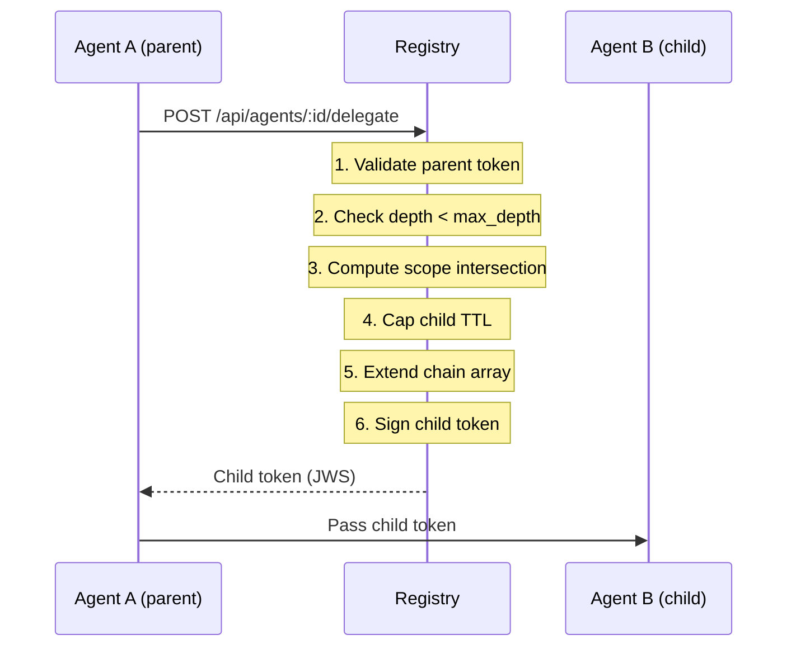
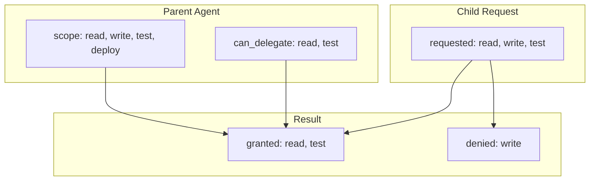
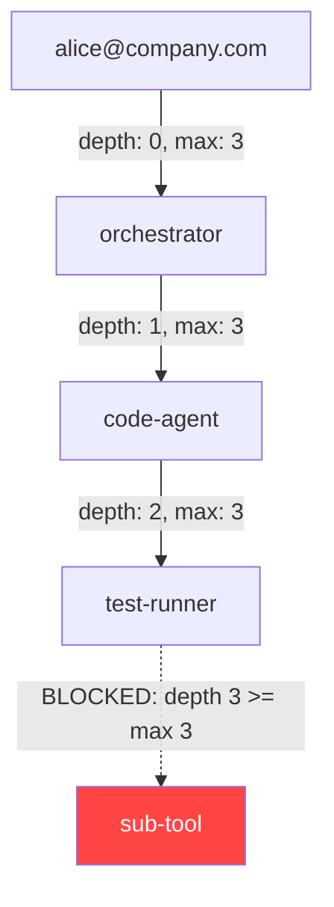
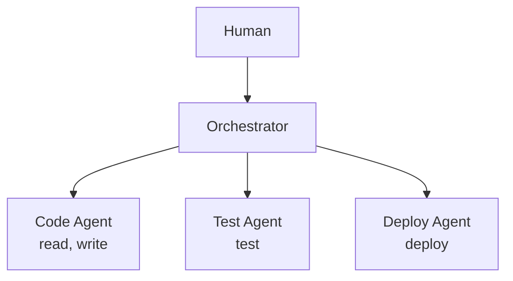
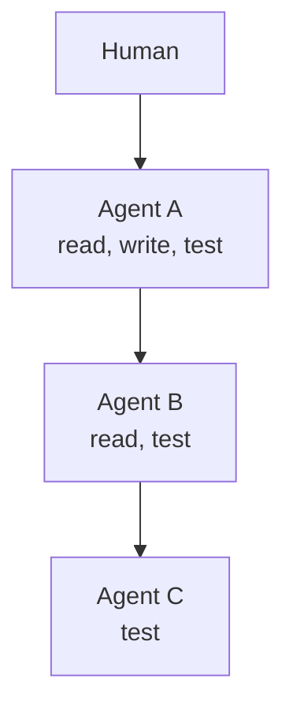
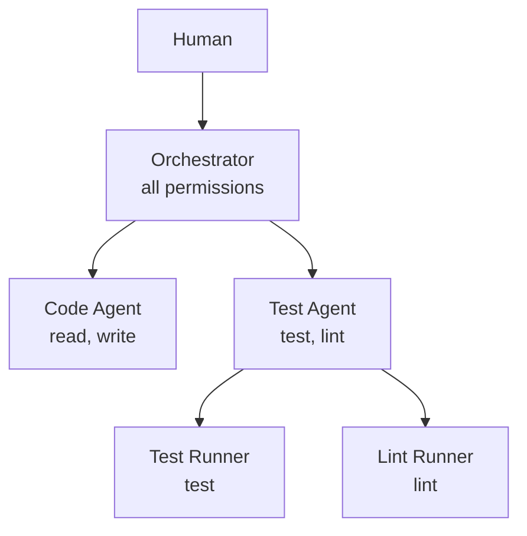

# Delegation Chains

Delegation is the mechanism by which one agent grants a subset of its permissions to another agent. This creates a chain of trust that extends from the original human operator through each intermediate agent down to the final tool-calling agent.

## Why Delegation Matters

In real-world AI workflows, agents do not work alone. A coding agent might spawn a test runner, which spawns a linter, which calls a file system tool. Without delegation chains, there is no way to answer:

- Who originally authorized this tool call?
- What permissions were intended at each hop?
- Can we revoke one sub-agent without affecting the rest?
- Is this agent operating within its intended scope?

Eigent's delegation system answers all of these questions by recording the full chain in every token.

## How Delegation Works

When Agent A delegates to Agent B, the following happens:



### Scope Intersection

The child's granted scope is the intersection of three sets:

```
granted = parent.scope ∩ requested_scope ∩ parent.can_delegate
```

This ensures that:

1. The child cannot have permissions the parent does not have
2. The child only gets what it explicitly requests
3. The parent controls which permissions are delegatable

### Example



In this example:

| Scope | In parent.scope? | In parent.can_delegate? | Requested? | Result |
|-------|:-:|:-:|:-:|--------|
| `read` | Yes | Yes | Yes | **Granted** |
| `write` | Yes | No | Yes | **Denied** |
| `test` | Yes | Yes | Yes | **Granted** |
| `deploy` | Yes | No | No | Not requested |

The child agent receives `[read, test]`. Even though the parent has `write` and `deploy`, neither can be delegated because `write` is not in `can_delegate` and `deploy` was not requested.

## Depth Limits

Every token carries a `depth` counter and a `max_depth` limit:

- **Root agents** (issued directly to a human) have `depth: 0`
- Each delegation increments the depth by 1
- Delegation is refused when `depth >= max_depth`



!!! tip "Choose max_depth carefully"
    For most workflows, a max_depth of 2-3 is sufficient. Deeper chains indicate complex orchestration that may warrant a different architecture (e.g., direct human authorization for deeply nested agents).

## Chain Recording

Every token records the full delegation path in the `delegation.chain` array. This is an ordered list of SPIFFE URIs representing each ancestor:

```json
{
  "delegation": {
    "depth": 2,
    "max_depth": 3,
    "chain": [
      "spiffe://company.example/agent/019746a2-orch",
      "spiffe://company.example/agent/019746b1-code"
    ],
    "can_delegate": ["run_tests"]
  }
}
```

Reading this chain tells you: this agent was authorized by `orch` (the orchestrator), which delegated to `code` (the code agent), which delegated to the current agent. The original human can be found in the `human` claim.

## CLI Usage

### Issuing with Delegation Control

```bash
# Issue an agent that can delegate only 'test' and 'lint'
eigent issue orchestrator \
  --scope read,write,test,lint,deploy \
  --can-delegate test,lint \
  --max-depth 3
```

### Delegating to a Child

```bash
# Delegate test and lint to a child agent
eigent delegate orchestrator qa-agent \
  --scope test,lint
```

### Viewing the Chain

```bash
# See the full delegation chain
eigent chain qa-agent
```

??? example "Expected output"
    ```
      Delegation Chain

      alice@company.com (human)
        └── orchestrator [read, write, test, lint, deploy] (depth 0)
              └── qa-agent [test, lint] (depth 1)
    ```

## TTL Constraints

A child token's TTL is automatically capped to the parent's remaining lifetime:

```
child_ttl = min(requested_ttl, parent.exp - now)
```

If a parent has 30 minutes remaining and the child requests 1 hour, the child gets 30 minutes. This prevents children from outliving their parents, which would create orphaned tokens with no valid chain.

## Delegation Validation

The `validateDelegationChain` function in `@eigent/core` performs comprehensive chain validation:

```typescript
import { validateDelegationChain } from '@eigent/core';

const result = await validateDelegationChain(token, registryPublicKey);

if (!result.valid) {
  console.error('Chain violations:', result.violations);
  // e.g., "Delegation depth (3) exceeds max_depth (2)"
  // e.g., "can_delegate scope 'write' is not in the token's scope list"
}
```

Validation checks include:

- [x] Token signature is valid
- [x] Depth matches chain length
- [x] Depth does not exceed max_depth
- [x] `can_delegate` is a subset of `scope`
- [x] All chain entries are valid SPIFFE URIs
- [x] No circular references in the chain

## Delegation Patterns

### Star Pattern

A single orchestrator delegates to multiple independent agents:



### Chain Pattern

Agents delegate sequentially, with permissions narrowing at each hop:



### Hybrid Pattern

Combine star and chain patterns for complex workflows:


