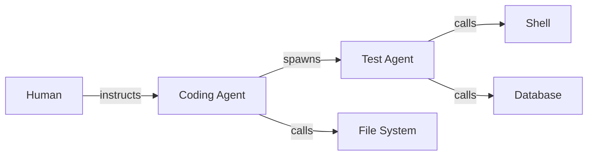
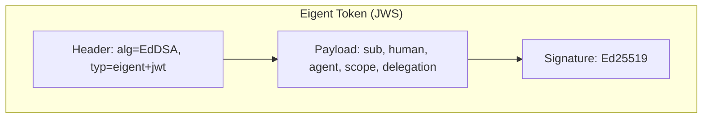
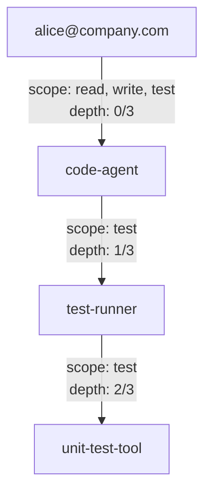
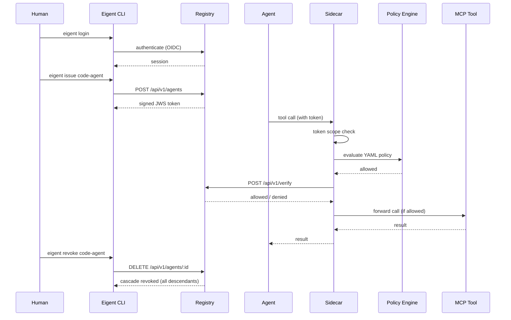

# Concepts Overview

Eigent is an identity and governance layer for AI agents. It answers the question that OAuth answered for web applications but for a world where autonomous software agents act on behalf of humans across chains of delegation.

## What is an Eigent?

An **eigent** (a portmanteau of "eigen" + "agent") is a cryptographic identity token that binds an AI agent to:

- The **human** who authorized it (verified via OIDC -- Okta, Entra ID, or Google)
- The **permissions** it is allowed to exercise
- The **delegation chain** through which it received those permissions
- A **time-bound** validity window

Every eigent is a signed JWS (JSON Web Signature) using Ed25519 cryptography. It can be verified by any party without contacting a central server, though the registry provides additional services like revocation checking, audit logging, compliance reporting, and SIEM webhooks.

## The Delegation Chain Problem

Modern AI systems do not operate as single agents. A typical workflow looks like this:



Without Eigent, every node in this graph operates anonymously. There is no way to answer basic governance questions:

- **Who authorized this agent** to access the database?
- **What permissions** does this sub-agent actually have?
- **Can we revoke** Agent B's access without affecting Agent A?
- **Who is liable** if Agent B deletes production data?
- **Does this delegation comply** with EU AI Act Article 14 (Human Oversight)?

## How Eigent Solves It

Eigent introduces five primitives that together provide complete agent governance:

### 1. Identity Tokens

Every agent receives a cryptographically signed token containing its identity, permissions, and delegation lineage. The token is self-verifiable and tamper-proof.



[:octicons-arrow-right-24: Token details](tokens.md)

### 2. Delegation Chains

When an agent delegates to a sub-agent, the child receives a new token with:

- A **narrower scope** (permissions can only decrease)
- An **incremented depth** counter
- An **extended chain** array recording the full delegation path



[:octicons-arrow-right-24: Delegation details](delegation.md)

### 3. Permission Governance

Permissions are computed as a three-way intersection:

```
granted = parent_scope ∩ requested_scope ∩ parent_can_delegate
```

This ensures that:

- A child can never have more permissions than its parent
- A parent explicitly controls what it allows children to have
- Requested permissions that fall outside the intersection are denied

[:octicons-arrow-right-24: Permission details](permissions.md)

### 4. Cascade Revocation

Revoking an agent automatically revokes all of its descendants. If Agent A is compromised, a single `eigent revoke code-agent` command invalidates Agent A and every agent it ever delegated to. SCIM deprovisioning automatically revokes all agents when a user leaves the organization.

[:octicons-arrow-right-24: Revocation details](revocation.md)

### 5. Runtime Enforcement

The sidecar proxy intercepts every MCP tool call and enforces permissions through multiple layers:

1. **Token scope check** -- is the tool in the agent's scope?
2. **YAML policy engine** -- glob patterns, argument regex, time windows, depth limits
3. **Approval queue** -- sensitive operations require human approval before execution
4. **Audit logging** -- every call (allowed or denied) is logged with full chain context

The policy engine supports hot-reloading, so policies take effect without restarting the sidecar.

[:octicons-arrow-right-24: Sidecar reference](../api/sidecar.md)

## The Eigent Flow

Here is the complete lifecycle of an agent identity:



## Design Principles

| Principle | Implementation |
|-----------|---------------|
| **Every agent has a human** | OIDC-verified human binding in every token; SCIM deprovision on user removal |
| **Least privilege** | Three-way scope intersection ensures permissions only narrow |
| **Short-lived by default** | 1-hour TTL; child cannot outlive parent |
| **Offline verification** | Ed25519 JWS can be verified without network calls via JWKS |
| **Cascade revocation** | Revoking parent revokes all descendants; SCIM triggers cascade |
| **Complete audit trail** | Every issuance, delegation, verification, revocation, and approval is logged |
| **Zero trust** | Every tool call is verified through token + policy engine, even from trusted agents |
| **Defense in depth** | Token scope + YAML policy + approval queue = three enforcement layers |
| **Multi-tenancy** | Organization-scoped isolation with per-org policies and compliance |

## Key Terms

Eigent token
:   A signed JWS containing agent identity, human binding, permissions, and delegation metadata. Uses Ed25519 (`EdDSA` algorithm) with `eigent+jwt` type header.

Delegation chain
:   The ordered list of agent identities from the root (human-authorized) agent to the current agent. Recorded in the token's `delegation.chain` array.

Scope
:   An array of strings representing permitted tool names or tool patterns (e.g., `read_file`, `db:*`, `*`).

Cascade revocation
:   The automatic revocation of all descendant agents when a parent agent is revoked.

Sidecar
:   A lightweight MCP traffic interceptor that enforces Eigent policies by verifying agent tokens and evaluating YAML policies before forwarding tool calls.

Policy engine
:   YAML-based rule engine supporting glob patterns, argument regex, time windows, delegation depth limits, and approval requirements. Hot-reloadable.

Approval queue
:   A mechanism for routing sensitive tool calls to human operators for approval before execution.

Trust domain
:   A SPIFFE-style namespace (e.g., `spiffe://company.example`) that scopes agent identities within an organization.

Organization
:   A multi-tenancy boundary. Agents, policies, and compliance reports are scoped to an organization.
