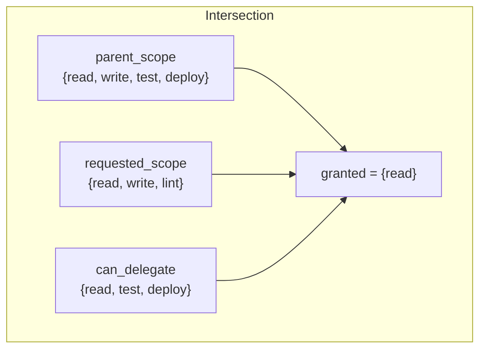
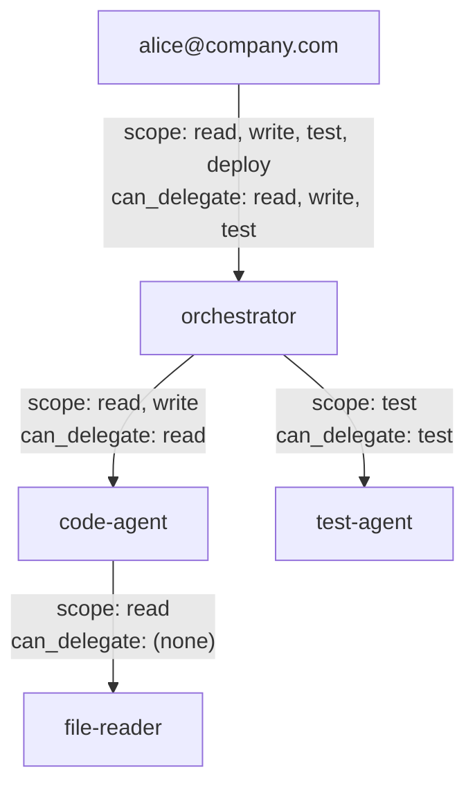

# Permission Model

Eigent's permission model ensures that AI agent permissions can only narrow as they flow through delegation chains, never widen. This is achieved through a three-way intersection model, wildcard scope matching, and strict delegation controls.

## Three-Way Intersection

Every delegation computes granted permissions as:

```
granted = parent_scope ∩ requested_scope ∩ parent_can_delegate
```

A scope is granted only if it appears in **all three sets**. This gives the system three independent levers of control:

1. **parent_scope** — what the parent agent is actually allowed to do
2. **requested_scope** — what the child agent is asking for
3. **parent_can_delegate** — what the parent has been authorized to pass on



### Implementation

The core library implements this in the `intersectScopes` function:

```typescript
import { intersectScopes } from '@eigent/core';

const result = intersectScopes(
  ['read', 'write', 'test', 'deploy'],  // parent scope
  ['read', 'write', 'lint'],             // requested scope
  ['read', 'test', 'deploy']             // can_delegate
);

console.log(result.granted); // ['read']
console.log(result.denied);  // ['write', 'lint']
```

**Why `write` is denied:** It is in `parent_scope` and `requested_scope`, but not in `can_delegate`.

**Why `lint` is denied:** It is in `requested_scope`, but not in `parent_scope` or `can_delegate`.

**Why `read` is granted:** It appears in all three sets.

## Wildcard Scopes

Eigent supports three forms of scope matching:

| Pattern | Example | Matches |
|---------|---------|---------|
| Exact | `read_file` | Only `read_file` |
| Prefix wildcard | `db:*` | `db:read`, `db:write`, `db:admin` |
| Global wildcard | `*` | Everything |

### Checking Permissions at Runtime

The `isActionAllowed` function checks whether a specific tool call is permitted by a token:

```typescript
import { isActionAllowed } from '@eigent/core';

const token = {
  scope: ['read_file', 'db:*'],
  // ... other fields
};

isActionAllowed(token, 'read_file');   // true  — exact match
isActionAllowed(token, 'db:read');     // true  — prefix wildcard
isActionAllowed(token, 'db:write');    // true  — prefix wildcard
isActionAllowed(token, 'write_file');  // false — no match
isActionAllowed(token, 'shell:exec');  // false — no match
```

### Wildcard Delegation Rules

Wildcards interact with the delegation system as follows:

| Parent scope | Parent can_delegate | Child requests | Granted |
|-------------|-------------------|----------------|---------|
| `*` | `*` | `read, write` | `read, write` |
| `db:*` | `db:*` | `db:read` | `db:read` |
| `db:read, db:write` | `db:read` | `db:read, db:write` | `db:read` |
| `*` | `read` | `read, write` | `read` |

!!! warning "Global wildcard is powerful"
    Issuing a token with `scope: ['*']` grants access to every tool. Use it only for root-level orchestrator agents that genuinely need unrestricted access. Prefer explicit scope lists.

## Delegation Check

Before delegating, you can verify whether a token holder can delegate specific scopes:

```typescript
import { canDelegate } from '@eigent/core';

const token = {
  scope: ['read', 'write', 'test'],
  delegation: {
    depth: 1,
    max_depth: 3,
    can_delegate: ['read', 'test'],
    chain: ['spiffe://example/agent/parent']
  }
};

canDelegate(token, ['read']);          // true
canDelegate(token, ['read', 'test']); // true
canDelegate(token, ['write']);         // false — not in can_delegate
canDelegate(token, ['deploy']);        // false — not in scope at all
```

The `canDelegate` function checks three conditions:

1. The token has not reached `max_depth`
2. All requested scopes are in the token's `scope`
3. All requested scopes are in the token's `delegation.can_delegate`

## Permission Examples

### Example 1: Coding Agent Workflow



| Agent | Can do | Cannot do | Can delegate |
|-------|--------|-----------|--------------|
| orchestrator | read, write, test, deploy | nothing else | read, write, test |
| code-agent | read, write | test, deploy | read |
| test-agent | test | read, write, deploy | test |
| file-reader | read | write, test, deploy | nothing (leaf) |

### Example 2: Database Access

```bash
# Issue with namespaced scopes
eigent issue db-agent \
  --scope "db:read,db:write,db:schema" \
  --can-delegate "db:read"

# Child can only read
eigent delegate db-agent reporting-agent \
  --scope "db:read"
```

`reporting-agent` receives `db:read` only. Even though it is a descendant of `db-agent`, it cannot write to or modify the database schema.

### Example 3: Denied Delegation

```bash
# Issue agent with restricted delegation
eigent issue restricted-agent \
  --scope "read,write,test" \
  --can-delegate "test"

# Try to delegate write — will be denied
eigent delegate restricted-agent child \
  --scope "write,test"
```

Result: `child` receives only `test`. The `write` scope is denied because it is not in `restricted-agent`'s `can_delegate` list.

## Best Practices

!!! tip "Principle of Least Privilege"
    Always grant the minimum set of scopes needed. Prefer explicit scope lists over wildcards.

!!! tip "Separate scope from can_delegate"
    An agent does not need to delegate everything it can do. A coding agent might need `read` and `write` access itself, but should only delegate `read` to helper agents.

!!! tip "Use namespaced scopes"
    Organize scopes hierarchically: `db:read`, `db:write`, `fs:read`, `fs:write`. This makes wildcard patterns more useful and permissions more readable.

!!! tip "Set appropriate max_depth"
    Most workflows need at most 2-3 levels of delegation. Setting max_depth higher than necessary increases the attack surface.
