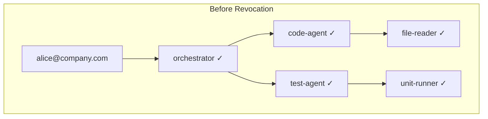
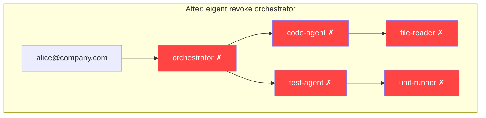

# Cascade Revocation

When an agent is compromised, misconfigured, or simply no longer needed, Eigent provides instant cascade revocation. Revoking a parent agent automatically and atomically revokes all of its descendants, closing the entire branch of the delegation tree in a single operation.

## Why Cascade Revocation?

Consider a delegation chain where an orchestrator has delegated to five sub-agents, each of which has delegated further. If the orchestrator is compromised, you need to revoke not just the orchestrator but every agent that traces its authority back to it. Manual revocation of each descendant is slow, error-prone, and leaves windows where compromised tokens remain active.

Cascade revocation solves this by treating the delegation tree as a single unit: revoking any node revokes the entire subtree below it.

## How It Works





A single `eigent revoke orchestrator` command revokes all 5 agents instantly. The next time any of these agents attempts a tool call, the verification will fail.

## Revocation Mechanics

### Registry-Side Cascade

When the registry receives a `DELETE /api/agents/:id` request:

1. The target agent's status is set to `revoked` with a `revoked_at` timestamp
2. All agents with `parent_id` pointing to the target are found recursively
3. Each descendant's status is set to `revoked`
4. An audit log entry is created for each revocation, noting whether it was a direct or cascade revocation

```typescript
// From eigent-registry: revokeAgentCascade
const revokedIds = revokeAgentCascade(agentId);
// Returns: ['agent-id', 'child-1', 'child-2', 'grandchild-1']
```

### Verification After Revocation

When a token is presented for verification (via `POST /api/verify`), the registry checks:

1. **Token signature** — is the JWS valid?
2. **Token expiration** — has the `exp` timestamp passed?
3. **Agent status** — is the agent record `active`?

If the agent has been revoked, the verification returns:

```json
{
  "allowed": false,
  "agent_id": "019746a2-...",
  "human_email": "alice@company.com",
  "reason": "Agent has been revoked"
}
```

An audit entry with action `tool_call_blocked` and reason `agent_revoked` is recorded.

## Short-Lived Tokens vs. Explicit Revocation

Eigent uses two complementary strategies for limiting token lifetime:

### Short-Lived Tokens (Passive Expiration)

- Default TTL: 1 hour
- Child TTL is capped by parent's remaining lifetime
- No action needed; tokens expire automatically
- Suitable for routine operations

### Explicit Revocation (Active Invalidation)

- Immediate effect; does not wait for TTL
- Cascades to all descendants
- Creates audit trail entries
- Required for security incidents

| Strategy | Latency | Audit Trail | Use Case |
|----------|---------|:-----------:|----------|
| TTL expiration | Up to 1 hour | No | Routine lifecycle |
| Explicit revocation | Immediate | Yes | Security incident, policy change |

!!! tip "Defense in depth"
    Use both strategies together. Short TTLs limit the blast radius of a compromised token, while explicit revocation handles known compromises immediately.

## Revocation Store

The core library provides a `RevocationStore` interface and an `InMemoryRevocationStore` implementation:

```typescript
import { InMemoryRevocationStore } from '@eigent/core';

const store = new InMemoryRevocationStore();

// Revoke a single token
store.revoke('token-jti-123', expiresAt);

// Check if revoked
store.isRevoked('token-jti-123'); // true

// Cascade revoke
const result = store.revokeWithCascade(
  'parent-jti',
  expiresAt,
  ['child-jti-1', 'child-jti-2']
);
// result: { revoked_agent_id: 'parent-jti', cascade_revoked: [...], total_revoked: 3 }

// Cleanup expired entries (they would have expired anyway)
const removed = store.cleanup();
```

!!! note "Production stores"
    The `InMemoryRevocationStore` is suitable for single-process deployments and testing. For production, implement `RevocationStore` backed by Redis, PostgreSQL, or another persistent store that your verification endpoints can query.

## CLI Usage

### Revoke a Single Agent (and Cascade)

```bash
eigent revoke code-agent
```

??? example "Expected output"
    ```
    ✔ Agent revoked.

      Revoked        code-agent
      Cascade        test-runner, file-reader
      Total Revoked  3
    ```

### Verify a Revoked Agent

```bash
eigent verify code-agent read_file
```

??? example "Expected output"
    ```
      DENIED  code-agent → read_file
      Agent code-agent is NOT authorized to call read_file
      Reason: Agent has been revoked
    ```

### Audit the Revocation

```bash
eigent audit --action revoked
```

The audit log shows both the direct and cascade revocations:

| Timestamp | Agent | Action | Details |
|-----------|-------|--------|---------|
| 2026-03-31 14:30:01 | code-agent | revoked | `reason: direct_revocation` |
| 2026-03-31 14:30:01 | test-runner | revoked | `reason: cascade_revocation, triggered_by: code-agent` |
| 2026-03-31 14:30:01 | file-reader | revoked | `reason: cascade_revocation, triggered_by: code-agent` |

## Revocation Scenarios

### Scenario 1: Compromised Agent

An agent's token has been leaked. Revoke immediately:

```bash
eigent revoke compromised-agent
```

All descendants are revoked. Re-issue new tokens after the incident is contained.

### Scenario 2: Employee Offboarding

When a human operator leaves the organization, revoke all agents they authorized:

```bash
# List agents by human
eigent list --all

# Revoke root agents (cascades to all their delegates)
eigent revoke agent-1
eigent revoke agent-2
```

### Scenario 3: Policy Change

Permissions need to be tightened. Revoke the old agent and re-issue with narrower scope:

```bash
eigent revoke old-agent
eigent issue new-agent --scope read_file --ttl 3600
```

## Design Decisions

**Why not token blacklists?** Traditional JWT revocation uses blacklists (checking every token against a list of revoked JTIs). Eigent uses the registry's agent status instead. This is simpler to implement, supports cascade logic naturally, and keeps the revocation check on the same data store as the rest of the agent lifecycle.

**Why cascade and not selective?** Selective revocation (revoking children but not the parent) is a valid use case, but it introduces complexity around orphaned chains. Eigent takes the conservative approach: if a parent is untrusted, its children should not be trusted either. Selective revocation can be achieved by revoking and re-issuing.
