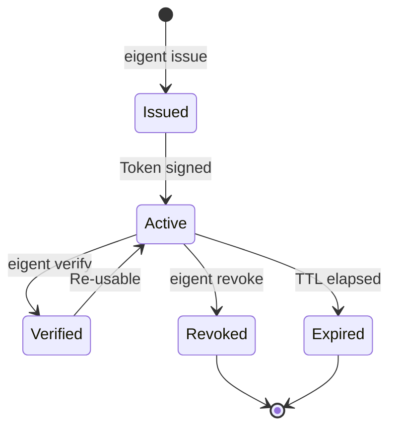

# Eigent Tokens

An Eigent token is a compact JSON Web Signature (JWS) that serves as the cryptographic identity for an AI agent. It binds together the agent's identity, the authorizing human, the granted permissions, and the delegation lineage into a single, tamper-proof, verifiable artifact.

## Token Structure

Every Eigent token follows the standard JWS compact serialization format: three Base64URL-encoded segments separated by dots.

```
<header>.<payload>.<signature>
```

### Header

The JOSE header identifies the cryptographic algorithm and token type:

```json
{
  "alg": "EdDSA",
  "typ": "eigent+jwt",
  "kid": "a1b2c3d4e5f6..."
}
```

| Field | Value | Description |
|-------|-------|-------------|
| `alg` | `EdDSA` | Ed25519 signature algorithm |
| `typ` | `eigent+jwt` | Distinguishes Eigent tokens from regular JWTs |
| `kid` | Key ID hash | SHA-256 thumbprint of the signing public key |

!!! info "Why Ed25519?"
    Ed25519 provides 128-bit security with compact 64-byte signatures. It is deterministic (no nonce-reuse vulnerabilities like ECDSA), fast to verify, and widely supported. The `EdDSA` algorithm identifier follows RFC 8037.

### Payload

The payload contains both standard JWT claims and Eigent-specific fields:

```json
{
  "jti": "019746a2-3f8b-7d4e-a1c5-9b3d2e7f0a1b",
  "sub": "spiffe://company.example/agent/019746a2-3f8b-7d4e",
  "iss": "https://eigent.dev/registry",
  "aud": "company.example",
  "iat": 1743350400,
  "exp": 1743354000,
  "human": {
    "sub": "user-abc123",
    "email": "alice@company.com",
    "iss": "https://accounts.google.com",
    "groups": ["engineering", "admin"]
  },
  "agent": {
    "name": "code-agent",
    "model": "claude-sonnet-4-20250514",
    "framework": "claude-desktop"
  },
  "scope": ["read_file", "write_file", "run_tests"],
  "delegation": {
    "depth": 0,
    "max_depth": 3,
    "chain": [],
    "can_delegate": ["run_tests"]
  }
}
```

#### Standard JWT Claims

| Claim | Type | Description |
|-------|------|-------------|
| `jti` | string | Unique token ID (UUIDv7 for time-ordering) |
| `sub` | string | SPIFFE URI identifying the agent |
| `iss` | string | Registry URL that issued the token |
| `aud` | string | Trust domain or audience |
| `iat` | number | Issued-at timestamp (Unix epoch) |
| `exp` | number | Expiration timestamp (Unix epoch) |

#### Human Binding

The `human` claim is what makes Eigent tokens fundamentally different from standard service tokens. Every agent identity traces back to a specific human.

| Field | Type | Description |
|-------|------|-------------|
| `human.sub` | string | Human's subject identifier from their IdP |
| `human.email` | string | Human's email address |
| `human.iss` | string | Human's identity provider URL |
| `human.groups` | string[] | Group memberships (for RBAC integration) |

!!! warning "This claim is immutable"
    The human binding is copied from parent to child during delegation. A child agent always carries the identity of the original authorizing human, not the parent agent. This ensures complete traceability.

#### Agent Metadata

| Field | Type | Description |
|-------|------|-------------|
| `agent.name` | string | Human-readable agent name |
| `agent.model` | string? | LLM model identifier (optional) |
| `agent.framework` | string? | Agent framework (optional) |

#### Scope

The `scope` array lists the specific tools or tool patterns the agent is authorized to call:

```json
"scope": ["read_file", "write_file", "db:read", "db:write"]
```

Scope values support wildcards:

- `"read_file"` — exact match
- `"db:*"` — matches any tool starting with `db:`
- `"*"` — global wildcard (matches everything)

#### Delegation

| Field | Type | Description |
|-------|------|-------------|
| `delegation.depth` | number | Current depth in the chain (0 = root) |
| `delegation.max_depth` | number | Maximum allowed delegation depth |
| `delegation.chain` | string[] | SPIFFE URIs of all ancestor agents |
| `delegation.can_delegate` | string[] | Scopes this agent can pass to children |

## Token Lifecycle



### Issuance

Tokens are issued by the registry in response to `POST /api/agents`. The registry:

1. Validates the human session
2. Generates a UUIDv7 agent identifier
3. Constructs the SPIFFE URI: `spiffe://<trust-domain>/agent/<agent-id>`
4. Signs the token with the registry's Ed25519 private key
5. Stores the agent record in the database
6. Returns the signed JWS token

### Verification

Token verification checks three things:

1. **Signature validity** — The Ed25519 signature matches the registry's public key
2. **Temporal validity** — The current time is between `iat` and `exp`
3. **Token type** — The `typ` header is `eigent+jwt`

```typescript
import { validateToken } from '@eigent/core';

const token = await validateToken(jws, registryPublicKey);
// Returns the decoded EigentToken or throws TokenError
```

### Expiration

Tokens have a default TTL of 1 hour (3600 seconds). Child tokens cannot outlive their parents: if a parent expires in 30 minutes, the child's TTL is capped at 30 minutes regardless of what was requested.

### Revocation

Tokens can be explicitly revoked before expiration. Revocation is immediate and cascading: revoking a parent revokes all descendants. See [Cascade Revocation](revocation.md) for details.

## Decoding a Token

You can decode a token without verifying its signature for debugging purposes:

=== "TypeScript"

    ```typescript
    import { decodeToken } from '@eigent/core';

    const decoded = decodeToken(jws);
    console.log(decoded.human.email);  // alice@company.com
    console.log(decoded.scope);        // ['read_file', 'write_file', 'run_tests']
    console.log(decoded.delegation);   // { depth: 0, max_depth: 3, chain: [], ... }
    ```

=== "Command line"

    ```bash
    # Decode the JWT payload (middle segment)
    echo "$TOKEN" | cut -d. -f2 | base64 -d 2>/dev/null | jq .
    ```

!!! danger "Do not trust decoded tokens"
    `decodeToken` does not verify the signature. Use it only for debugging and display. Always use `validateToken` for authorization decisions.

## SPIFFE URI Format

Agent identities follow the SPIFFE (Secure Production Identity Framework for Everyone) URI format:

```
spiffe://<trust-domain>/agent/<agent-id>
```

For example:

```
spiffe://company.example/agent/019746a2-3f8b-7d4e-a1c5-9b3d2e7f0a1b
```

This provides a globally unique, hierarchical identifier that is compatible with service mesh identity systems like Istio, SPIRE, and Consul Connect.
