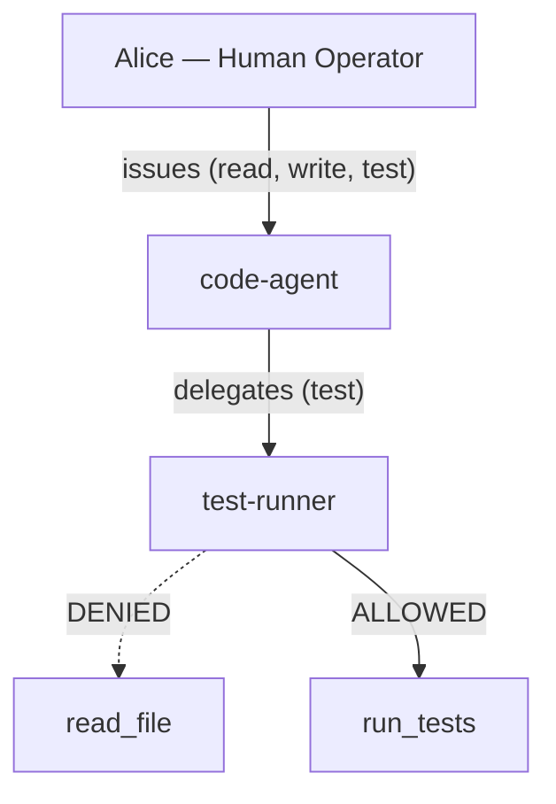

# Your First Eigent

This tutorial walks you through creating your first agent identity in 60 seconds. By the end, you will have a human-bound, cryptographically signed agent token that you can use to gate MCP tool calls.

## What You Will Build

A simple delegation chain where:

1. **Alice** (human) authenticates with Eigent
2. Alice issues an identity for **code-agent** with `read`, `write`, and `test` permissions
3. `code-agent` delegates `test` permission to **test-runner**
4. You verify that `test-runner` can run tests but cannot read or write files



## Prerequisites

- [x] CLI installed (`npm install -g @eigent/cli`)
- [x] Registry running (`cd eigent-registry && npm run dev`)

## Step 1: Initialize and Login

Open a terminal in your project directory:

```bash
# Initialize Eigent (creates .eigent/ directory)
eigent init

# Authenticate as Alice
eigent login -e alice@company.com
```

!!! info "What just happened?"
    `eigent init` created a `.eigent/` directory with a `config.json` pointing to the local registry. `eigent login` simulated an OIDC flow and stored Alice's session. In production, this would redirect to your corporate identity provider.

## Step 2: Issue the Root Agent

Create an identity for your primary AI agent:

```bash
eigent issue code-agent \
  --scope read_file,write_file,run_tests \
  --ttl 3600 \
  --max-depth 3 \
  --can-delegate run_tests
```

Let us break down each flag:

| Flag | Value | Meaning |
|------|-------|---------|
| `--scope` | `read_file,write_file,run_tests` | Tools this agent can use |
| `--ttl` | `3600` | Token expires in 1 hour |
| `--max-depth` | `3` | Up to 3 levels of sub-delegation |
| `--can-delegate` | `run_tests` | Only `run_tests` can be passed to children |

!!! warning "Deliberate restriction"
    Notice that `code-agent` has `read_file` and `write_file` in its own scope, but `--can-delegate` only includes `run_tests`. This means `code-agent` can read and write files itself, but it cannot grant those permissions to any sub-agent. This is the principle of least delegation.

## Step 3: Delegate to a Child

Now delegate the `run_tests` permission to a test runner agent:

```bash
eigent delegate code-agent test-runner \
  --scope run_tests
```

The delegation engine computes: `granted = parent.scope ∩ requested ∩ parent.can_delegate`. Since `run_tests` is in all three sets, the delegation succeeds. If `test-runner` had requested `read_file`, it would be denied because `read_file` is not in `code-agent`'s `can_delegate` list.

## Step 4: Verify Permissions

Test the permission boundaries:

```bash
# Should succeed: code-agent has read_file
eigent verify code-agent read_file

# Should succeed: test-runner has run_tests
eigent verify test-runner run_tests

# Should fail: test-runner does NOT have read_file
eigent verify test-runner read_file
```

??? example "Expected terminal output"
    ```
      ALLOWED  code-agent → read_file
      Agent code-agent is authorized to call read_file

      ALLOWED  test-runner → run_tests
      Agent test-runner is authorized to call run_tests

      DENIED  test-runner → read_file
      Agent test-runner is NOT authorized to call read_file
      Reason: Tool "read_file" is not in agent scope: [run_tests]
    ```

## Step 5: Inspect the Chain

View the full delegation chain for `test-runner`:

```bash
eigent chain test-runner
```

??? example "Expected output"
    ```
      Delegation Chain

      alice@company.com (human)
        └── code-agent [read_file, write_file, run_tests] (depth 0)
              └── test-runner [run_tests] (depth 1)
    ```

This chain is embedded in `test-runner`'s token. Any service verifying the token can trace the full path back to Alice.

## Step 6: Revoke and Observe Cascade

Revoke `code-agent` and watch the cascade:

```bash
eigent revoke code-agent
```

??? example "Expected output"
    ```
    ✔ Agent revoked.

      Revoked        code-agent
      Cascade        test-runner
      Total Revoked  2
    ```

Both `code-agent` and `test-runner` are now revoked. Any future verification of either agent will fail immediately.

```bash
# This now fails
eigent verify test-runner run_tests
# DENIED — Agent has been revoked
```

## Step 7: Check the Audit Trail

Review everything that happened:

```bash
eigent audit
```

The audit log contains a complete record of every issuance, delegation, verification, and revocation, all tied back to `alice@company.com`.

## What You Learned

1. **Human binding** - Every agent traces back to a human identity
2. **Scoped permissions** - Agents receive only the tools they need
3. **Delegation narrowing** - Child agents get a subset of parent permissions
4. **Verification** - Tool calls are checked against the token in real time
5. **Cascade revocation** - Revoking a parent automatically revokes all children
6. **Audit trail** - Every action is logged with full chain context

## Next Steps

- [Concepts Overview](../concepts/overview.md) to understand the theory behind Eigent
- [MCP Server Integration](../guides/mcp-integration.md) to protect real MCP servers
- [CI/CD Pipeline](../guides/cicd.md) to scan for unprotected agents in your build
