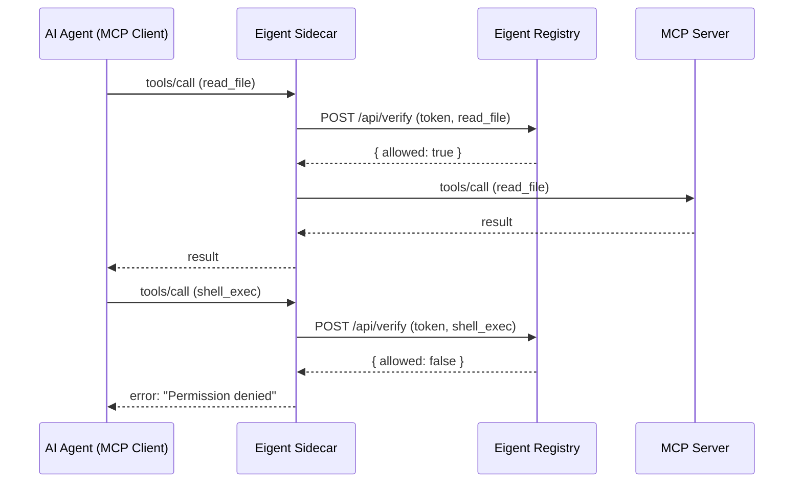

# MCP Server Integration

The Eigent sidecar sits between your AI agent (the MCP client) and the MCP server, intercepting every tool call and verifying it against the agent's Eigent token before forwarding. This guide covers how the sidecar works, how to configure it, and how to handle blocked calls.

## How the Sidecar Works

The sidecar is a transparent MCP proxy. It implements the MCP protocol on both sides: it looks like an MCP server to the client and like an MCP client to the actual server.



## Configuration

### Basic Setup

```bash
# Install the sidecar
npm install -g @eigent/sidecar

# Issue an agent token
eigent issue my-agent --scope read_file,write_file --ttl 3600

# Wrap an MCP server
eigent wrap npx -y @modelcontextprotocol/server-filesystem /tmp \
  --agent my-agent
```

### Claude Desktop Configuration

The sidecar integrates with Claude Desktop by replacing the direct MCP server command with a wrapped version.

**Before (unprotected):**

```json
{
  "mcpServers": {
    "filesystem": {
      "command": "npx",
      "args": ["-y", "@modelcontextprotocol/server-filesystem", "/home/user/projects"]
    }
  }
}
```

**After (protected with Eigent):**

```json
{
  "mcpServers": {
    "filesystem": {
      "command": "eigent-sidecar",
      "args": [
        "--mode", "enforce",
        "--eigent-token-file", "~/.eigent/tokens/code-agent.jwt",
        "--registry-url", "http://localhost:3456",
        "--",
        "npx", "-y", "@modelcontextprotocol/server-filesystem", "/home/user/projects"
      ]
    }
  }
}
```

Everything before `--` configures the sidecar. Everything after `--` is the original MCP server command, passed through unchanged.

## Operating Modes

The sidecar supports two modes:

### Enforce Mode (Default)

In enforce mode, the sidecar blocks tool calls that are not in the agent's scope. Blocked calls return an error to the client and are logged to the audit trail.

```bash
eigent-sidecar --mode enforce --eigent-token "$TOKEN" -- npx server-filesystem /tmp
```

!!! danger "Use enforce mode in production"
    Enforce mode is the only mode that actually prevents unauthorized tool calls. Monitor mode is for evaluation only.

### Monitor Mode

In monitor mode, the sidecar allows all tool calls but logs whether each call would have been allowed or denied. Use this mode when evaluating Eigent before enforcing policies.

```bash
eigent-sidecar --mode monitor --eigent-token "$TOKEN" -- npx server-filesystem /tmp
```

Monitor mode produces the same audit trail as enforce mode, but with action `tool_call_would_block` instead of `tool_call_blocked`. This lets you review what would change before enabling enforcement.

## Sidecar Configuration Options

| Option | Default | Description |
|--------|---------|-------------|
| `--mode` | `enforce` | `enforce` or `monitor` |
| `--eigent-token` | — | Inline token string |
| `--eigent-token-file` | — | Path to token file |
| `--registry-url` | `http://localhost:3456` | Registry endpoint |
| `--otel-endpoint` | — | OpenTelemetry collector URL |
| `--otel-service-name` | `eigent-sidecar` | Service name for OTel spans |
| `--log-level` | `info` | `debug`, `info`, `warn`, `error` |

Environment variables are also supported:

```bash
export EIGENT_TOKEN="eyJ..."
export EIGENT_REGISTRY_URL="http://localhost:3456"
export OTEL_EXPORTER_OTLP_ENDPOINT="http://localhost:4318"
```

## Handling Blocked Calls

When a tool call is blocked in enforce mode, the sidecar returns an MCP error response:

```json
{
  "jsonrpc": "2.0",
  "id": 1,
  "error": {
    "code": -32600,
    "message": "Eigent: permission denied for tool 'shell_exec'. Agent scope: [read_file, write_file]. Contact alice@company.com to request access."
  }
}
```

The error message includes:

- The tool that was denied
- The agent's current scope
- The human to contact for additional permissions

This gives the AI agent enough context to inform the user or try an alternative approach rather than failing silently.

## OpenTelemetry Integration

The sidecar exports OpenTelemetry spans for every tool call, providing real-time observability:

```bash
eigent-sidecar \
  --mode enforce \
  --eigent-token-file ~/.eigent/tokens/code-agent.jwt \
  --otel-endpoint http://localhost:4318 \
  -- npx server-filesystem /tmp
```

Each span includes:

| Attribute | Example | Description |
|-----------|---------|-------------|
| `mcp.tool.name` | `read_file` | Tool being called |
| `eigent.agent.id` | `019746a2-...` | Agent identifier |
| `eigent.agent.name` | `code-agent` | Agent name |
| `eigent.human.email` | `alice@company.com` | Authorizing human |
| `eigent.action` | `allowed` / `blocked` | Authorization result |
| `eigent.delegation.depth` | `1` | Current chain depth |
| `eigent.scope` | `read_file,write_file` | Agent's scope |

See [SIEM Integration](siem.md) for connecting these spans to Splunk, Datadog, or Jaeger.

## Multiple MCP Servers

For environments with multiple MCP servers, wrap each one with its own sidecar and token:

```json
{
  "mcpServers": {
    "filesystem": {
      "command": "eigent-sidecar",
      "args": [
        "--mode", "enforce",
        "--eigent-token-file", "~/.eigent/tokens/fs-agent.jwt",
        "--", "npx", "-y", "@modelcontextprotocol/server-filesystem", "/tmp"
      ]
    },
    "postgres": {
      "command": "eigent-sidecar",
      "args": [
        "--mode", "enforce",
        "--eigent-token-file", "~/.eigent/tokens/db-agent.jwt",
        "--", "npx", "-y", "@modelcontextprotocol/server-postgres"
      ]
    }
  }
}
```

Each server gets a separate agent token with its own scope. The filesystem agent cannot access the database, and the database agent cannot access the filesystem.

## Troubleshooting

### Sidecar not found

```bash
# Verify installation
which eigent-sidecar

# Install globally
npm install -g @eigent/sidecar
```

### Token file not found

Ensure you have issued a token and it has been saved:

```bash
ls ~/.eigent/tokens/
eigent issue my-agent --scope read_file
```

### Registry unreachable

The sidecar needs to contact the registry for verification. Check the registry is running:

```bash
curl http://localhost:3456/api/health
```

### All calls being blocked

Check that the agent's scope matches the tool names used by the MCP server. Tool names are case-sensitive and must match exactly:

```bash
eigent verify my-agent read_file    # Check specific tools
eigent list                          # See all agents and scopes
```
