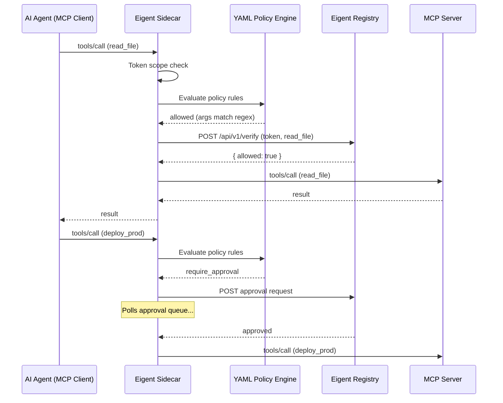

# MCP Server Integration

The Eigent sidecar sits between your AI agent (the MCP client) and the MCP server, intercepting every tool call and verifying it against the agent's Eigent token and the YAML policy engine before forwarding. This guide covers the sidecar, YAML policies, approval queue, and production configuration.

## How the Sidecar Works

The sidecar is a transparent MCP proxy. It implements the MCP protocol on both sides: it looks like an MCP server to the client and like an MCP client to the actual server.



## Basic Setup

```bash
# Install the sidecar
npm install -g @eigent/sidecar

# Issue an agent token
eigent issue my-agent --scope read_file,write_file --ttl 3600

# Wrap an MCP server (stdio mode)
eigent wrap npx -y @modelcontextprotocol/server-filesystem /tmp \
  --agent my-agent
```

## Claude Desktop Configuration

Replace the direct MCP server command with a wrapped version.

**Before (unprotected):**

```json
{
  "mcpServers": {
    "filesystem": {
      "command": "npx",
      "args": ["-y", "@modelcontextprotocol/server-filesystem", "/home/user/projects"]
    }
  }
}
```

**After (protected with Eigent + YAML policy):**

```json
{
  "mcpServers": {
    "filesystem": {
      "command": "eigent-sidecar",
      "args": [
        "--mode", "enforce",
        "--eigent-token-file", "~/.eigent/tokens/code-agent.jwt",
        "--registry-url", "http://localhost:3456",
        "--policy-file", "~/.eigent/policies/filesystem.yaml",
        "--",
        "npx", "-y", "@modelcontextprotocol/server-filesystem", "/home/user/projects"
      ]
    }
  }
}
```

Everything before `--` configures the sidecar. Everything after `--` is the original MCP server command, passed through unchanged.

## HTTP Proxy Mode

For network-accessible MCP servers (SSE or HTTP transport), use HTTP proxy mode instead of stdio:

```bash
eigent-sidecar \
  --transport http \
  --listen-port 8080 \
  --upstream-url http://mcp-server:3000 \
  --eigent-token-file ~/.eigent/tokens/code-agent.jwt \
  --policy-file ./eigent-policy.yaml
```

The sidecar listens on `http://localhost:8080` and proxies verified requests to the upstream server.

## YAML Policy Engine

Beyond token scopes, the policy engine provides fine-grained control with glob patterns, argument validation, time windows, and approval requirements. Policies hot-reload -- no restart required.

### Example Policy

```yaml
# eigent-policy.yaml
version: "1"

policies:
  # Allow file reads only within project directory
  - tool: "read_file"
    allow: true
    conditions:
      args:
        path: "^/home/user/projects/.*"

  # Block file writes outside business hours
  - tool: "write_file"
    allow: true
    conditions:
      time_window:
        start: "09:00"
        end: "18:00"
        timezone: "America/New_York"

  # Allow all database tools up to depth 2
  - tool: "db:*"
    allow: true
    conditions:
      max_delegation_depth: 2

  # Block shell execution
  - tool: "shell_exec"
    allow: false

  # Require approval for deployments
  - tool: "deploy_*"
    allow: true
    require_approval: true

defaults:
  allow: false
```

### Policy Features

| Feature | Description |
|---------|-------------|
| **Glob patterns** | Match tool names with `*` wildcards: `db:*`, `deploy_*` |
| **Argument regex** | Validate arguments: `args.path: "^/safe/.*"` |
| **Time windows** | Restrict by time: `09:00-18:00 America/New_York` |
| **Depth limits** | Restrict by delegation depth: `max_delegation_depth: 2` |
| **Approval required** | Route to approval queue: `require_approval: true` |
| **Hot reload** | Changes to the YAML file take effect without restart |

### Evaluation Order

1. **Token scope check** -- is the tool in the agent's token scope?
2. **Policy rule match** -- first matching rule in the YAML wins
3. **Default policy** -- the `defaults.allow` value applies if no rule matches
4. **Approval routing** -- if `require_approval: true`, hold and poll queue

## Approval Queue

For sensitive operations (production deploys, database mutations, etc.), the policy engine routes tool calls to the approval queue. The sidecar holds the call and polls the registry until a human operator approves or denies it.

### Configuring Approval

In your policy file:

```yaml
policies:
  - tool: "deploy_*"
    allow: true
    require_approval: true
```

On the sidecar:

```bash
eigent-sidecar \
  --policy-file ./eigent-policy.yaml \
  --approval-poll-interval 3000 \
  --eigent-token "$TOKEN" \
  -- npx server-filesystem /tmp
```

### Approving Requests

Operators can approve requests via the dashboard or the registry API:

```bash
# List pending approvals
curl http://localhost:3456/api/v1/approvals

# Approve
curl -X POST http://localhost:3456/api/v1/approvals/apr-123/approve

# Deny with reason
curl -X POST http://localhost:3456/api/v1/approvals/apr-123/deny \
  -H "Content-Type: application/json" \
  -d '{"reason": "Not authorized for production deploy"}'
```

## Operating Modes

### Enforce Mode (Default)

Blocks tool calls that fail verification. Use in production.

```bash
eigent-sidecar --mode enforce --eigent-token "$TOKEN" -- npx server-filesystem /tmp
```

### Monitor Mode

Allows all calls but logs what would be blocked. Use for evaluation.

```bash
eigent-sidecar --mode monitor --eigent-token "$TOKEN" -- npx server-filesystem /tmp
```

Monitor mode produces the same audit trail as enforce mode, but with action `tool_call_would_block` instead of `tool_call_blocked`.

## OpenTelemetry Integration

Export spans for every tool call:

```bash
eigent-sidecar \
  --otel-endpoint http://localhost:4318 \
  --otel-service-name my-agent-sidecar \
  --eigent-token "$TOKEN" \
  -- npx server-filesystem /tmp
```

Each span includes tool name, agent ID, human email, authorization result, delegation depth, scope, policy rule matched, and mode.

## Prometheus Metrics

Expose metrics for Grafana dashboards:

```bash
eigent-sidecar \
  --prometheus-port 9090 \
  --eigent-token "$TOKEN" \
  -- npx server-filesystem /tmp
```

Metrics available at `http://localhost:9090/metrics`:

- `eigent_tool_calls_total` -- tool calls by tool, action, and agent
- `eigent_tool_call_duration_seconds` -- latency histogram
- `eigent_policy_evaluations_total` -- policy evaluations by result
- `eigent_approval_queue_pending` -- pending approvals gauge

## Multiple MCP Servers

Wrap each server with its own sidecar, token, and policy:

```json
{
  "mcpServers": {
    "filesystem": {
      "command": "eigent-sidecar",
      "args": [
        "--mode", "enforce",
        "--eigent-token-file", "~/.eigent/tokens/fs-agent.jwt",
        "--policy-file", "~/.eigent/policies/filesystem.yaml",
        "--", "npx", "-y", "@modelcontextprotocol/server-filesystem", "/tmp"
      ]
    },
    "postgres": {
      "command": "eigent-sidecar",
      "args": [
        "--mode", "enforce",
        "--eigent-token-file", "~/.eigent/tokens/db-agent.jwt",
        "--policy-file", "~/.eigent/policies/database.yaml",
        "--", "npx", "-y", "@modelcontextprotocol/server-postgres"
      ]
    }
  }
}
```

Each server gets a separate agent token with its own scope and policy file.

## Troubleshooting

### Sidecar not found

```bash
which eigent-sidecar
npm install -g @eigent/sidecar
```

### Token file not found

```bash
ls ~/.eigent/tokens/
eigent issue my-agent --scope read_file
```

### Registry unreachable

```bash
curl http://localhost:3456/api/v1/health
```

### All calls being blocked

1. Check token scope: `eigent verify my-agent read_file`
2. Check policy file for restrictive rules or `defaults.allow: false`
3. Run with `--log-level debug` to see evaluation details
