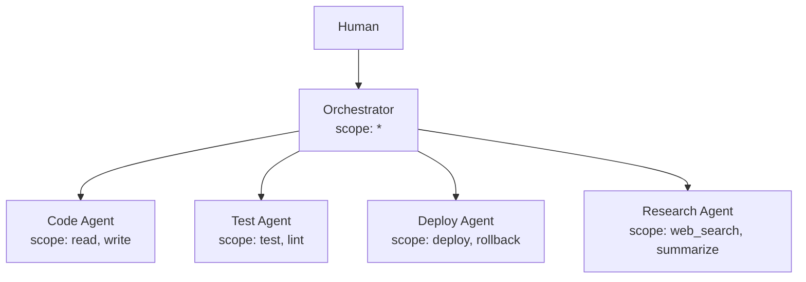
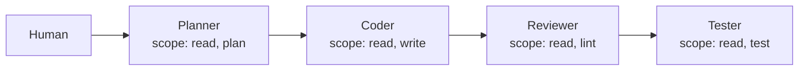
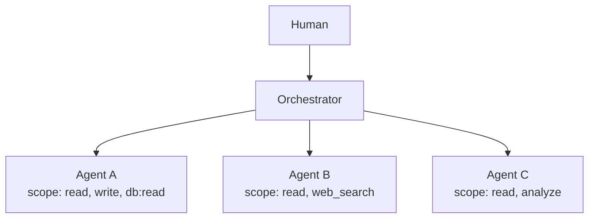

# Multi-Agent Workflows

Eigent is designed for multi-agent systems where multiple AI agents collaborate, delegate tasks, and call tools on behalf of a human operator. This guide covers delegation patterns and integration with popular multi-agent frameworks.

## Delegation Patterns

### Hub and Spoke

A central orchestrator delegates to specialized agents. Each spoke agent has narrow, non-overlapping permissions.



```bash
eigent issue orchestrator --scope "*" --can-delegate "read,write,test,lint,deploy,rollback,web_search,summarize" --max-depth 2

eigent delegate orchestrator code-agent --scope "read,write"
eigent delegate orchestrator test-agent --scope "test,lint"
eigent delegate orchestrator deploy-agent --scope "deploy,rollback"
eigent delegate orchestrator research-agent --scope "web_search,summarize"
```

### Pipeline

Agents hand off work sequentially, with each stage having only the permissions it needs for its portion of the pipeline.



Each agent delegates to the next stage with a narrower scope. The tester cannot write files. The reviewer cannot execute tests. Permissions narrow at each hop.

### Peer Collaboration

Multiple agents at the same delegation depth collaborate through shared tools. Each has access to a common workspace but different specialized tools.



## CrewAI + Eigent

[CrewAI](https://crewai.com) is a popular framework for orchestrating multiple AI agents. Eigent adds identity and permission governance to CrewAI workflows.

### Setup

```bash
pip install crewai
npm install -g @eigent/cli
```

### Issue Tokens for Each Crew Member

```bash
eigent login -e team-lead@company.com

# Researcher — can search and summarize
eigent issue researcher \
  --scope web_search,summarize,read_file \
  --max-depth 1

# Writer — can read and write files
eigent issue writer \
  --scope read_file,write_file \
  --max-depth 1

# Reviewer — can only read
eigent issue reviewer \
  --scope read_file,lint \
  --max-depth 0
```

### Integrate with CrewAI

```python
import os
from crewai import Agent, Task, Crew

# Each agent gets its Eigent token as an environment variable
# The sidecar uses this to enforce permissions on tool calls

researcher = Agent(
    role="Researcher",
    goal="Find relevant information",
    backstory="Expert researcher",
    tools=[search_tool, summarize_tool],
    # Eigent token injected via environment
)

writer = Agent(
    role="Writer",
    goal="Write comprehensive content",
    backstory="Expert technical writer",
    tools=[file_read_tool, file_write_tool],
)

reviewer = Agent(
    role="Reviewer",
    goal="Review and improve content quality",
    backstory="Expert editor",
    tools=[file_read_tool, lint_tool],
)

# Create the crew
crew = Crew(
    agents=[researcher, writer, reviewer],
    tasks=[research_task, write_task, review_task],
    verbose=True,
)
```

### Wrap MCP Tools with Sidecar

Each crew member's tools are wrapped with the Eigent sidecar:

```python
import subprocess

def create_eigent_tool(agent_name, mcp_command, mcp_args):
    """Create an MCP tool wrapped with Eigent enforcement."""
    token_path = os.path.expanduser(f"~/.eigent/tokens/{agent_name}.jwt")

    return subprocess.Popen(
        [
            "eigent-sidecar",
            "--mode", "enforce",
            "--eigent-token-file", token_path,
            "--registry-url", "http://localhost:3456",
            "--",
            mcp_command, *mcp_args,
        ],
        stdin=subprocess.PIPE,
        stdout=subprocess.PIPE,
    )
```

## LangGraph + Eigent

[LangGraph](https://langchain-ai.github.io/langgraph/) builds agent workflows as directed graphs. Eigent tokens map naturally to graph nodes.

### Issue Tokens per Node

```bash
eigent issue planner --scope "read,plan" --can-delegate "read" --max-depth 2
eigent issue executor --scope "read,write,shell" --can-delegate "read" --max-depth 1
eigent issue validator --scope "read,test,lint" --max-depth 0
```

### Integrate with LangGraph

```python
from langgraph.graph import StateGraph, END
from typing import TypedDict

class AgentState(TypedDict):
    task: str
    result: str
    eigent_token: str  # Current agent's token

def plan_node(state: AgentState) -> AgentState:
    # Token for planner is injected
    # Sidecar enforces: only read and plan tools allowed
    return {**state, "eigent_token": load_token("planner")}

def execute_node(state: AgentState) -> AgentState:
    # Token for executor is injected
    # Sidecar enforces: read, write, shell allowed
    return {**state, "eigent_token": load_token("executor")}

def validate_node(state: AgentState) -> AgentState:
    # Token for validator is injected
    # Sidecar enforces: read, test, lint allowed
    return {**state, "eigent_token": load_token("validator")}

# Build the graph
workflow = StateGraph(AgentState)
workflow.add_node("plan", plan_node)
workflow.add_node("execute", execute_node)
workflow.add_node("validate", validate_node)

workflow.set_entry_point("plan")
workflow.add_edge("plan", "execute")
workflow.add_edge("execute", "validate")
workflow.add_edge("validate", END)

app = workflow.compile()
```

## A2A Protocol Support (Planned)

Google's Agent-to-Agent (A2A) protocol defines how agents communicate across boundaries. Eigent plans to integrate with A2A by providing:

- **Agent Cards** with Eigent identity metadata
- **Token exchange** during A2A handshakes
- **Scope negotiation** as part of the A2A capability discovery
- **Audit events** for cross-boundary agent interactions

!!! info "Roadmap"
    A2A integration is on the Eigent roadmap. Follow [GitHub Issues](https://github.com/saichandrasekhar/Eigent/issues) for updates.

## Best Practices for Multi-Agent Workflows

!!! tip "One token per agent role"
    Issue a separate Eigent token for each agent in your workflow. Do not share tokens between agents, even if they have similar permissions.

!!! tip "Use delegation for dynamic sub-agents"
    If an orchestrator spawns sub-agents at runtime, use `eigent delegate` to create child tokens. This ensures every dynamic agent has proper identity and scoping.

!!! tip "Set max_depth based on workflow topology"
    A simple hub-and-spoke needs `max_depth: 1`. A deep pipeline might need `max_depth: 3-4`. Set it to the minimum required.

!!! tip "Monitor with the audit trail"
    Use `eigent audit` to observe the actual permission usage across your multi-agent workflow. This helps you tighten scopes over time.

!!! tip "Use monitor mode during development"
    Start with the sidecar in monitor mode to understand what tools each agent actually calls. Then configure scopes based on observed behavior.

## Visualizing Multi-Agent Chains

Use the CLI to visualize the delegation tree:

```bash
eigent chain validator
```

??? example "Expected output"
    ```
    Delegation Chain

    team-lead@company.com (human)
      └── orchestrator [*] (depth 0)
            ├── planner [read, plan] (depth 1)
            ├── executor [read, write, shell] (depth 1)
            └── validator [read, test, lint] (depth 1)
    ```

The chain view makes it easy to audit the complete permission structure of your multi-agent system at a glance.
