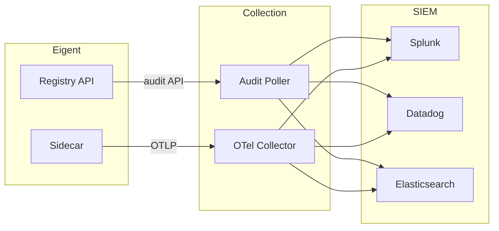

# SIEM Integration

Eigent exports audit events and telemetry data to your existing Security Information and Event Management (SIEM) platform. This guide covers integration with Splunk, Datadog, and generic OpenTelemetry collectors.

## Architecture

Eigent provides two data paths for SIEM integration:



1. **Audit API polling** — Pull audit events from the registry REST API
2. **OpenTelemetry export** — Push real-time spans from the sidecar

## OpenTelemetry Collector Setup

The recommended approach uses the OpenTelemetry Collector as a central hub:

```yaml
# otel-collector-config.yaml
receivers:
  otlp:
    protocols:
      grpc:
        endpoint: 0.0.0.0:4317
      http:
        endpoint: 0.0.0.0:4318

processors:
  batch:
    timeout: 5s
    send_batch_size: 1024

  attributes:
    actions:
      - key: eigent.environment
        value: production
        action: upsert

exporters:
  splunk_hec:
    token: "${SPLUNK_HEC_TOKEN}"
    endpoint: "https://splunk.company.com:8088/services/collector"
    source: "eigent"
    sourcetype: "eigent:otel"
    index: "ai_security"

  datadog:
    api:
      key: "${DD_API_KEY}"
      site: "datadoghq.com"

  otlphttp:
    endpoint: "https://otel.company.com:4318"

service:
  pipelines:
    traces:
      receivers: [otlp]
      processors: [batch, attributes]
      exporters: [splunk_hec, datadog]
```

Start the collector:

```bash
docker run -d \
  -p 4317:4317 -p 4318:4318 \
  -v $(pwd)/otel-collector-config.yaml:/etc/otel/config.yaml \
  -e SPLUNK_HEC_TOKEN="your-token" \
  -e DD_API_KEY="your-key" \
  otel/opentelemetry-collector-contrib:latest \
  --config /etc/otel/config.yaml
```

Configure the sidecar to send spans to the collector:

```bash
eigent-sidecar \
  --mode enforce \
  --eigent-token-file ~/.eigent/tokens/agent.jwt \
  --otel-endpoint http://localhost:4318 \
  -- npx server-filesystem /tmp
```

## Splunk Integration

### Via HEC (HTTP Event Collector)

Configure Splunk to receive Eigent audit events directly:

```bash
# Poll the audit API and forward to Splunk HEC
curl -s "http://localhost:3456/api/audit?from_date=$(date -u -v-5M +%Y-%m-%dT%H:%M:%S)&limit=100" | \
  jq -c '.entries[]' | \
  while read -r event; do
    curl -k "https://splunk.company.com:8088/services/collector/event" \
      -H "Authorization: Splunk $SPLUNK_HEC_TOKEN" \
      -d "{\"event\": $event, \"sourcetype\": \"eigent:audit\", \"index\": \"ai_security\"}"
  done
```

### Splunk Search Queries

```spl
# All blocked tool calls in the last 24 hours
index=ai_security sourcetype="eigent:audit" action="tool_call_blocked"
| table timestamp agent_name tool_name human_email details.reason

# Agents with most blocked calls
index=ai_security sourcetype="eigent:audit" action="tool_call_blocked"
| stats count by agent_name
| sort -count

# Revocation cascade events
index=ai_security sourcetype="eigent:audit" action="revoked"
| spath details.reason
| where 'details.reason'="cascade_revocation"
| table timestamp agent_name details.triggered_by

# New agent issuance rate
index=ai_security sourcetype="eigent:audit" action="issued"
| timechart span=1h count
```

## Datadog Integration

### Via OTel Collector

Use the OTel Collector with the Datadog exporter (shown above). Spans appear in Datadog APM under the `eigent-sidecar` service.

### Via Audit API

Forward audit events to Datadog Logs:

```bash
# Forward audit events to Datadog
curl -s "http://localhost:3456/api/audit?limit=100" | \
  jq -c '.entries[] | {
    message: (.action + " " + (.tool_name // "lifecycle")),
    ddsource: "eigent",
    ddtags: ("agent:" + .agent_name + ",human:" + .human_email),
    hostname: "eigent-registry",
    service: "eigent",
    status: (if .action == "tool_call_blocked" then "warning" elif .action == "revoked" then "error" else "info" end)
  }' | \
  curl -X POST "https://http-intake.logs.datadoghq.com/api/v2/logs" \
    -H "Content-Type: application/json" \
    -H "DD-API-KEY: $DD_API_KEY" \
    -d @-
```

### Datadog Monitors

Create monitors for critical Eigent events:

- **Blocked tool calls spike** — Alert when `tool_call_blocked` events exceed a threshold
- **Mass revocation** — Alert when cascade revocation affects more than 5 agents
- **New agent burst** — Alert when more than 10 agents are issued within 5 minutes

## OCSF Event Format

Eigent audit events map to the Open Cybersecurity Schema Framework (OCSF) for compatibility with modern SIEMs:

| Eigent Field | OCSF Field | Category |
|-------------|------------|----------|
| `action: issued` | `Activity: Create` | Identity & Access (3001) |
| `action: delegated` | `Activity: Delegate` | Identity & Access (3001) |
| `action: revoked` | `Activity: Revoke` | Identity & Access (3001) |
| `action: tool_call_allowed` | `Activity: Access Granted` | Authorization (3003) |
| `action: tool_call_blocked` | `Activity: Access Denied` | Authorization (3003) |
| `human_email` | `actor.user.email` | — |
| `agent_id` | `actor.process.uid` | — |
| `tool_name` | `resource.name` | — |
| `delegation_chain` | `metadata.labels` | — |

## Custom Integration

For SIEMs not listed above, use the Audit API to build a custom integration:

```python
import requests
import time
from datetime import datetime, timedelta

REGISTRY_URL = "http://localhost:3456"
POLL_INTERVAL = 30  # seconds

last_check = datetime.utcnow() - timedelta(minutes=5)

while True:
    response = requests.get(f"{REGISTRY_URL}/api/audit", params={
        "from_date": last_check.isoformat(),
        "limit": 100,
    })

    events = response.json()["entries"]

    for event in events:
        # Forward to your SIEM
        forward_to_siem(event)

    if events:
        last_check = datetime.fromisoformat(events[-1]["timestamp"])

    time.sleep(POLL_INTERVAL)
```

## Alert Rules

Recommended alert rules for any SIEM:

| Alert | Condition | Severity |
|-------|-----------|----------|
| Unauthorized tool access | `action == tool_call_blocked` count > 10 in 5 min | High |
| Agent revocation cascade | `action == revoked` with `cascade_revocation` > 5 agents | Critical |
| Shadow agent detected | `eigent-scan` finding with severity `critical` | Critical |
| Token expired but still used | `action == tool_call_blocked` with reason `token_expired` | Medium |
| New agent without Eigent token | Scan detects MCP server without token | High |

## Best Practices

!!! tip "Use OTel for real-time, Audit API for batch"
    The sidecar's OTel integration provides sub-second latency for tool call events. The Audit API is better for batch processing and historical analysis.

!!! tip "Correlate with existing security data"
    Link Eigent events with your existing SIEM data using `human_email` as the join key. This lets you correlate agent actions with the human's other activities.

!!! tip "Retain audit data"
    Configure your SIEM retention to match compliance requirements (1 year for SOC 2, lifecycle for EU AI Act).
