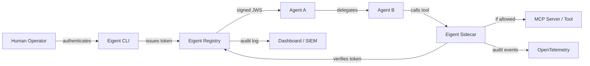

---
hide:
  - navigation
  - toc
---

# **Eigent** — OAuth for AI Agents

<div class="grid cards" markdown>

-   :material-shield-lock:{ .lg .middle } **Cryptographic Identity**

    ---

    Every AI agent gets a signed, verifiable identity token bound to the human who authorized it. No more anonymous agents.

    [:octicons-arrow-right-24: Learn about tokens](concepts/tokens.md)

-   :material-source-branch:{ .lg .middle } **Delegation Chains**

    ---

    Agent A delegates to Agent B, which delegates to Tool C. Every hop is recorded, scoped, and auditable.

    [:octicons-arrow-right-24: Understand delegation](concepts/delegation.md)

-   :material-lock-check:{ .lg .middle } **Permission Governance**

    ---

    Three-way scope intersection ensures permissions can only narrow, never widen. Least privilege by construction.

    [:octicons-arrow-right-24: Permission model](concepts/permissions.md)

-   :material-magnify-scan:{ .lg .middle } **Agent Discovery**

    ---

    Scan 14 config locations to find every MCP server, shadow agent, and LLM-powered process in your environment.

    [:octicons-arrow-right-24: Quick start](getting-started/quickstart.md)

</div>

---

## The Problem

**OAuth solved:** *this app acts on behalf of this user.*

**Eigent solves:** *this agent acts on behalf of this human, through these other agents, with constrained permissions, and every action is logged back to the authorizing human.*

Today's AI agents operate with broad, unmonitored access. They call tools, spawn sub-agents, and access sensitive resources with no identity, no audit trail, and no way to trace actions back to the responsible human. This is the equivalent of giving every employee the root password and hoping for the best.

Eigent provides the missing identity and governance layer for AI agents, the same way OAuth provided identity for web applications.

---

## Quick Install

=== "CLI (npm)"

    ```bash
    npm install -g @eigent/cli
    ```

=== "Scanner (pip)"

    ```bash
    pip install eigent-scan
    ```

=== "Sidecar (npm)"

    ```bash
    npm install -g @eigent/sidecar
    ```

Then get started in 60 seconds:

```bash
eigent init                                    # Initialize project
eigent login -e alice@company.com              # Authenticate as human
eigent issue code-agent -s read,write,test     # Issue agent identity
eigent verify code-agent read                  # Check permissions
```

---

## Why Eigent?

| Metric | Value | Source |
|--------|-------|--------|
| AI agent-to-human ratio by 2028 | **144:1** | Gartner, 2025 |
| Organizations with AI agent security incidents | **88%** | Industry reports, 2025 |
| Projected agent identity market | **$38.8B** by 2028 | Market analysis |
| Shadow AI breach cost premium | **$670K** more than standard | IBM Cost of Data Breach, 2025 |

Your developers are installing MCP servers with filesystem access, shell execution, and database credentials with **zero authentication** and **zero monitoring**. Eigent finds them all and locks them down.

---

## How Eigent Compares

| Capability | **Eigent** | Astrix Security | Okta NHI | DIY (OPA + ELK) |
|---|:---:|:---:|:---:|:---:|
| MCP server discovery | :white_check_mark: | :x: | :x: | :x: |
| Shadow agent detection | :white_check_mark: | Partial | :x: | Manual |
| Cryptographic identity tokens | :white_check_mark: | :x: | :x: | Custom |
| Delegation chain governance | :white_check_mark: | :x: | :x: | :x: |
| Cascade revocation | :white_check_mark: | :x: | Partial | Custom |
| SARIF / GitHub Security | :white_check_mark: | :x: | :x: | :x: |
| OTel telemetry sidecar | :white_check_mark: | :x: | :x: | Custom |
| Open source | :white_check_mark: | :x: | :x: | :white_check_mark: |
| Setup time | **30 seconds** | Weeks | Weeks | Months |
| Price | **Free** | $$$$$ | $$$$$ | Engineering time |

---

## Architecture at a Glance



---

## Components

| Component | Package | Description |
|-----------|---------|-------------|
| **eigent-cli** | `@eigent/cli` (npm) | Human-facing CLI for identity management |
| **eigent-core** | `@eigent/core` (npm) | Token issuance, delegation, permission logic |
| **eigent-registry** | `@eigent/registry` (npm) | Central identity registry with audit log |
| **eigent-sidecar** | `@eigent/sidecar` (npm) | MCP traffic interceptor with OTel export |
| **eigent-scan** | `eigent-scan` (PyPI) | Security scanner for agent discovery |

---

<div class="grid cards" markdown>

-   :material-rocket-launch:{ .lg .middle } **Get Started**

    ---

    Go from zero to a secured agent in 5 minutes.

    [:octicons-arrow-right-24: Quick start guide](getting-started/quickstart.md)

-   :material-book-open-variant:{ .lg .middle } **Read the Concepts**

    ---

    Understand delegation chains, tokens, and permissions.

    [:octicons-arrow-right-24: Concepts overview](concepts/overview.md)

-   :material-api:{ .lg .middle } **API Reference**

    ---

    Full REST API, CLI commands, and library docs.

    [:octicons-arrow-right-24: API reference](api/registry.md)

-   :material-scale-balance:{ .lg .middle } **Compliance**

    ---

    EU AI Act and SOC 2 mapping with evidence generation.

    [:octicons-arrow-right-24: Compliance docs](compliance/eu-ai-act.md)

</div>
