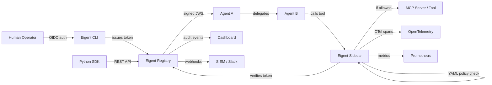

---
hide:
  - navigation
  - toc
---

# **Eigent** — OAuth for AI Agents

<div class="grid cards" markdown>

-   :material-shield-lock:{ .lg .middle } **Cryptographic Identity**

    ---

    Every AI agent gets an Ed25519-signed JWS token bound to the human who authorized it. No more anonymous agents. Self-verifiable and tamper-proof.

    [:octicons-arrow-right-24: Learn about tokens](concepts/tokens.md)

-   :material-source-branch:{ .lg .middle } **Delegation Chains**

    ---

    Agent A delegates to Agent B, which delegates to Tool C. Every hop narrows permissions. Every chain is recorded, scoped, and auditable.

    [:octicons-arrow-right-24: Understand delegation](concepts/delegation.md)

-   :material-lock-check:{ .lg .middle } **Runtime Enforcement**

    ---

    MCP sidecar with YAML policy engine -- glob patterns, time windows, argument regex, depth limits. Approval queue for sensitive operations. Prometheus metrics and OTel spans.

    [:octicons-arrow-right-24: Sidecar reference](api/sidecar.md)

-   :material-magnify-scan:{ .lg .middle } **Agent Discovery**

    ---

    Free scanner finds every MCP server, shadow agent, and LLM-powered process across 14 config locations. SARIF output for GitHub Security tab.

    [:octicons-arrow-right-24: Quick start](getting-started/quickstart.md)

</div>

---

## The Problem

**OAuth solved:** *this app acts on behalf of this user.*

**Eigent solves:** *this agent acts on behalf of this human, through these other agents, with constrained permissions, and every action is logged back to the authorizing human.*

Today's AI agents operate with broad, unmonitored access. They call tools, spawn sub-agents, and access sensitive resources with no identity, no audit trail, and no way to trace actions back to the responsible human. This is the equivalent of giving every employee the root password and hoping for the best.

Eigent provides the missing identity and governance layer for AI agents, the same way OAuth provided identity for web applications.

---

## Quick Install

=== "Docker Compose (full stack)"

    ```bash
    git clone https://github.com/saichandrasekhar/Eigent.git
    cd Eigent && docker compose up
    ```

=== "CLI (npm)"

    ```bash
    npm install -g @eigent/cli
    ```

=== "Python SDK (pip)"

    ```bash
    pip install eigent
    ```

=== "Scanner (pip)"

    ```bash
    pip install eigent-scan
    ```

=== "Helm (Kubernetes)"

    ```bash
    helm install eigent deploy/helm/eigent
    ```

Then get started in 60 seconds:

```bash
eigent init                                    # Initialize project
eigent login -e alice@company.com              # Authenticate via OIDC
eigent issue code-agent -s read,write,test     # Issue agent identity
eigent delegate code-agent runner -s test      # Delegate with narrowing
eigent verify runner test                      # Check permissions
eigent verify runner write                     # DENIED - narrowed out
```

---

## Why Eigent?

| Metric | Value | Source |
|--------|-------|--------|
| AI agent-to-human ratio by 2028 | **144:1** | Gartner, 2025 |
| Organizations with AI agent security incidents | **88%** | Industry reports, 2025 |
| Projected agent identity market | **$38.8B** by 2028 | Market analysis |
| Shadow AI breach cost premium | **$670K** more than standard | IBM Cost of Data Breach, 2025 |

---

## How Eigent Compares

| Capability | **Eigent** | Okta / Entra ID | Aembit | Astrix |
|---|:---:|:---:|:---:|:---:|
| Human-to-agent identity binding | :white_check_mark: | :x: | :x: | Partial |
| Agent-to-agent delegation chains | :white_check_mark: | :x: | :x: | :x: |
| Permission narrowing at each hop | :white_check_mark: | :x: | :x: | :x: |
| Cascade revocation | :white_check_mark: | Partial | :x: | :x: |
| MCP-native enforcement sidecar | :white_check_mark: | :x: | Partial | :x: |
| YAML policy engine (glob, time, regex) | :white_check_mark: | :x: | :x: | :x: |
| Approval queue for sensitive ops | :white_check_mark: | :x: | :x: | :x: |
| OIDC SSO (Okta, Entra, Google) | :white_check_mark: | :white_check_mark: | :white_check_mark: | :x: |
| SCIM deprovisioning | :white_check_mark: | :white_check_mark: | :x: | :x: |
| Multi-tenancy | :white_check_mark: | :white_check_mark: | :white_check_mark: | :x: |
| Compliance reports (EU AI Act, SOC 2) | :white_check_mark: | :x: | :x: | Partial |
| SIEM webhooks | :white_check_mark: | :white_check_mark: | :white_check_mark: | :white_check_mark: |
| Python SDK | :white_check_mark: | :white_check_mark: | :x: | :x: |
| MCP server discovery | :white_check_mark: | :x: | :x: | Partial |
| Open source | :white_check_mark: | :x: | :x: | :x: |
| Setup time | **5 minutes** | Weeks | Weeks | Weeks |

---

## Architecture at a Glance



---

## Components

| Component | Package | Description |
|-----------|---------|-------------|
| **eigent-core** | `@eigent/core` (npm) | Ed25519 crypto, JWS tokens, delegation, scope intersection, revocation (76 tests) |
| **eigent-registry** | `@eigent/registry` (npm) | Hono API -- OIDC, SCIM, multi-tenancy, approval queue, compliance, PostgreSQL, AES-256-GCM |
| **eigent-sidecar** | `@eigent/sidecar` (npm) | MCP interceptor -- stdio + HTTP, YAML policy engine, approval queue, OTel, Prometheus |
| **eigent-cli** | `@eigent/cli` (npm) | 16 commands for full agent lifecycle management |
| **eigent-py** | `eigent` (PyPI) | Python SDK -- EigentClient + @eigent_protected decorator |
| **eigent-scan** | `eigent-scan` (PyPI) | Security scanner for agent discovery (14 config locations, shadow detection) |
| **eigent-dashboard** | — | Next.js -- 6 pages, NextAuth SSO, RBAC (admin/operator/viewer) |
| **deploy/helm** | — | Kubernetes Helm chart |
| **deploy/terraform** | — | Terraform IaC modules |

---

<div class="grid cards" markdown>

-   :material-rocket-launch:{ .lg .middle } **Get Started**

    ---

    Go from zero to a secured agent in 5 minutes with Docker Compose.

    [:octicons-arrow-right-24: Quick start guide](getting-started/quickstart.md)

-   :material-book-open-variant:{ .lg .middle } **Read the Concepts**

    ---

    Understand delegation chains, tokens, and permissions.

    [:octicons-arrow-right-24: Concepts overview](concepts/overview.md)

-   :material-api:{ .lg .middle } **API Reference**

    ---

    Full REST API, CLI commands, sidecar config, and Python SDK.

    [:octicons-arrow-right-24: API reference](api/registry.md)

-   :material-scale-balance:{ .lg .middle } **Compliance**

    ---

    EU AI Act and SOC 2 mapping with automated evidence generation.

    [:octicons-arrow-right-24: Compliance docs](compliance/eu-ai-act.md)

</div>
